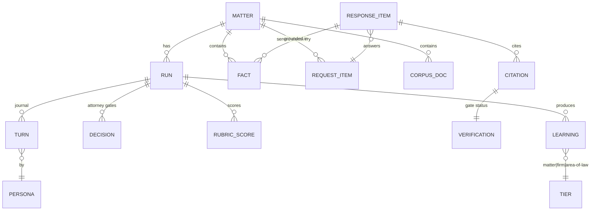

# ✨ feat: MootLoop v1 — Agentic Litigation Pipeline (Discovery Responses)

## Enhancement Summary

**Deepened on:** 2026-07-11 · **Agents used:** 14 (3 skill-appliers: agent-native-architecture, create-agent-skills, claude-api · 3 researchers: multi-agent orchestration literature, MN/federal discovery practice, export-tooling · 8 reviewers: architecture, security, performance, simplicity, data-integrity, agent-native parity, Python design, pattern consistency)

### Key improvements
1. **Orchestrator moves into Python** behind `TurnExecutor`/`LLMProvider` protocols (skills/CLI become thin drivers) — without this, the Agent SDK extraction, CLI parity, and resume all break. Highest-leverage structural decision; must land in Phase 2.
2. **Adversarial threat model added:** served discovery is hostile input authored by opposing counsel — injection fencing, no tool-calls-from-ingested-content, path/symlink hardening, Drive ACL read-back, ethical walls between matters, fail-closed gates.
3. **Budget tiers redesigned:** worked cost model shows panel size barely moves cost (Opus core-loop output ≈ 60–75% of every run); tiers now vary persona model + iteration caps + output caps. Prompt-caching the shared matter record is a ~2.5× input-cost lever.
4. **Run-scale engineering targets:** a full run is 1,000–6,000 subagent calls — orchestrator context must stay flat (pointer + ≤500-token summaries), global concurrency semaphore ≈ 6–8, append-only JSONL journal, one global CourtListener token bucket.
5. **Evidence-backed loop calibration:** debate gains plateau by round 3 (low caps confirmed); rubric panels fixed at 3 *decorrelated* judges with median aggregation regardless of budget; jury-off-by-default validated (subjective-persona validity κ=.318).
6. **Deterministic completeness gate now has legal content:** MN/FRCP rule-by-rule checklist (MN-only interrogatory restatement + exact perjury verification language; RFA deemed-admission traps; *Fischer*/*Liguria*/*Heller* boilerplate-objection sanctions as rubric criteria).
7. **Export round-trip made concrete:** pandoc + court reference-doc (line numbering/watermark/caption live in the template); anchors as Div-ID→Word-bookmarks keyed to immutable request numbers; own OOXML reader on reimport (pandoc's reader drops bookmarks; Google Docs ignores API comment anchors).
8. **Data lifecycle gaps closed:** verification-cache TTL + "no citator" disclosure (stale "verified" = citing dead law), matter-close retention/destruction command, attestation manifest covering master + ledger + exports, sync-folder guards, stale-lock protocol.
9. **YAGNI re-sequencing:** edit-learning, GDoc lane, calibrated judge, and non-discovery adapters move behind the first live serve — ~8–10 sessions pulled off the critical path with zero locked decisions touched.
10. **Ship as a Claude Code plugin** (`/mootloop:*` namespace) — flat skills can't colon-namespace, and "moot" is too common a legal word to squat.

Full detail in **Deepening Insights** below; original phases retained with inline corrections.

## Overview

MootLoop is an agentic law firm simulator: six legal personas (Associate, Partner, Opposing-Counsel Associate, Opposing-Counsel Partner, Judge panel, Jury panel) draft, attack, and adjudicate legal work product through rubric-gated iteration loops before a human attorney reads a page. V1 is **Claude Code-native** (agent definitions + skills + a small Python package; Fable orchestrates, Opus subagents perform persona work) and its proving ground is a live lawsuit: producing **discovery responses** (interrogatory answers, RFP responses, RFA responses) end-to-end, with every quality gate the portfolio's hard-won lessons demand.

All 26 brainstorm decisions carry into this plan (see brainstorm: `docs/brainstorms/2026-07-11-mootloop-brainstorm.md`), plus three plan-stage product decisions (P-27..P-29 below) that resolved the gaps spec-flow analysis surfaced.

## Problem Statement

Lawyers using AI as a chatbot get one-shot drafts. The article's thesis ("The Agentic Law Firm") is that iterated, adversarially-tested, panel-adjudicated work product is categorically better — but no OSS system implements the full arc with the guardrails a *real* matter requires: verified citations, zero fabrication, confidentiality boundaries, attorney judgment gates, and auditable traces. MootLoop builds that system, proving it on a real case before generalizing to the full FOLIO task catalog.

Three structural problems the plan must solve (from spec-flow analysis):

1. **Task-shape mismatch:** the persona pipeline was conceived for motions; discovery responses have no pending motion for a Judge to "rule" on. → Solved by **task adapters** (P-27).
2. **Facts are not citations:** interrogatory answers require *client facts with provenance*, not just verified law. → Solved by a **structured fact repository + fabrication gate** distinct from the citation gate.
3. **Attorney judgment is not automatable:** objection posture, privilege calls, and RFA admissions are professional-judgment calls. → Solved by **propose-then-approve attorney gates** (P-28).

## Plan-Stage Decisions (append to brainstorm's 26)

| # | Decision | Choice |
|---|----------|--------|
| P-27 | Panel semantics per task | **Task adapters** define per-task defaults for what panels adjudicate. Discovery default: Judge panel simulates the motion-to-compel / protective-order fight per objection ("would this objection survive?"); Jury panel **off** by default. Users can easily enable more panels (e.g., Jury on discovery) when token/money constraints allow. |
| P-28 | Attorney gates | **Propose-then-approve** default set — (1) objection posture per request type, (2) every privilege call, (3) every RFA admit/deny/qualify, (4) any factual assertion lacking provenance — personas propose with reasoning, attorney approves/modifies. Fully configurable (gates list in `matter.yaml`); autonomous mode batches gates into one review checkpoint. |
| P-29 | Production scope | **Light production help**: MootLoop drafts responses + objections + privilege log AND suggests responsive/non-responsive classification of vault corpus docs per RFP. The attorney makes all production calls; Bates ranges are human-supplied. |

## Proposed Solution

A public OSS repo (`mootloop`) containing persona agents, task adapters, skills, and a deterministic Python core — operating on private **matter vaults** that never touch the repo.

### Repo layout

```
mootloop/
├── .claude/
│   ├── agents/                    # persona subagents (YAML frontmatter + prompt)
│   │   ├── associate.md  partner.md  oc-associate.md  oc-partner.md
│   │   ├── judge.md  juror.md     # parameterized: philosophy / juror profile
│   │   ├── rubric-judge.md        # scores work product against locked rubrics
│   │   └── cite-checker.md        # LLM half of citation/fabrication gates
│   └── skills/
│       ├── moot/SKILL.md          # /moot — run pipeline on a matter task
│       ├── moot-setup/            # /moot:setup — init vault, matter.yaml wizard
│       ├── moot-ingest/           # /moot:ingest — corpus + requests + facts
│       ├── moot-decide/           # /moot:decide — review pending attorney gates
│       ├── moot-status/           # /moot:status — run progress + traces
│       ├── moot-export/           # /moot:export — deliverables + attestation
│       └── moot-learn/            # /moot:learn — edit-diff learning pass
├── AGENTS.md                      # symlinked to CLAUDE.md (house pattern)
├── config/
│   ├── defaults.yaml              # personas, loop caps, budget tiers, run mode, gates
│   ├── tasks/                     # task adapters (see below)
│   │   ├── discovery-responses.yaml
│   │   ├── complaint.yaml  answer.yaml  outgoing-discovery.yaml  motion.yaml
│   └── courts/                    # caption/format templates (user-supplied)
├── personas/                      # prompt bodies: generic-excellence standards
├── rubrics/                       # LOCKED, versioned rubrics per task type
├── playbooks/                     # OSS area-of-law playbooks (scrubbed learnings)
├── src/mootloop/                  # deterministic core (uv + hatchling, src-layout)
│   ├── vault.py                   # vault resolution, matter.yaml schema, run lock
│   ├── journal.py                 # run-state journal (resume), iteration traces
│   ├── requests_parser.py         # served discovery → per-request work items
│   ├── facts.py                   # fact repository, provenance index
│   ├── gates/
│   │   ├── degeneracy.py          # non-empty / non-vacuous assertions per turn
│   │   ├── citations.py           # eyecite + CourtListener/eCFR/GovInfo/Revisor
│   │   ├── fabrication.py         # every assertion traces to facts/ or corpus/
│   │   └── residue.py             # annotation-strip verification at export
│   ├── convergence.py             # copied ConvergenceEvaluator, real deltas
│   ├── budget.py                  # estimate, meter, hard-cap abort, $-equivalent
│   ├── export/                    # md-master → docx / gdoc / memo / audit log
│   ├── learn.py                   # reimport, anchor diff, 3-tier routing, scrub
│   └── cli.py                     # `mootloop` CLI mirror of skills (agent-native parity)
├── tools/                         # copied: evidence-pack/, render-diff.py,
│   │                              #   qa-artifact.py, lane-watch.sh
│   └── privacy_grep.py            # pre-commit vault-leak blocker
├── fixtures/synthetic-matter/     # alea-data-generator demo matter (public-domain only)
├── tests/{unit,integration,property,invariants}/
└── docs/{brainstorms,plans,solutions}/
```

### Matter vault layout (private, e.g. `~/Matters/<matter-id>/`)

```
matter.yaml            # court, caption, parties+roles, our_side, judge, jurisdiction,
                       #   deadlines, enabled personas/panels, gates config, budget tier
corpus/
│   ├── originals/  normalized/   # originals + canonical Markdown
│   └── manifest.json             # per-doc: role tag (complaint|answer|served-discovery|
│                                 #   client-doc|authority), privilege flag, ingest status
facts/                 # structured client facts: {id, statement, provenance[], confidence}
requests/              # parsed incoming discovery: per-request work items (number, type, text)
law/                   # curated authorities (tier-1 citable) + verification cache
runs/<run-id>/
│   ├── journal.jsonl             # APPEND-ONLY event log (one fsync'd line per completed
│   │                             #   turn/gate/decision/spend event); state = fold(events);
│   │                             #   resume = replay persisted turn outputs, re-run frontier only
│   ├── turns/                    # every persona turn as a readable artifact
│   ├── decisions/                # attorney-gate records (qa-artifact schema)
│   └── scores/                   # rubric-judge outputs, panel distributions
deliverables/          # md-master + exports + strategy memos + audit logs
learnings/             # matter-tier learnings
research-requests/     # Westlaw/Lexis bridge queue (system asks, human fulfills)
```

Firm profile (private, shared across matters, git-private shareable): `~/.mootloop/firm/` — `preferences.yaml`, `style/` (optional style corpus), `learnings/`.

### Execution model

- **The orchestrator state machine lives in `src/mootloop/`** behind two protocols: `LLMProvider` (persona invocation — Claude Code Agent-spawn adapter in v1, `alea-llm-client` adapter at SDK extraction) and `Stage` (immutable context in, journal-foldable result out). `/mootloop:run` (skill) and `mootloop run` (CLI) are thin drivers over the same Python entrypoint. Judgment (loop-again, concede-vs-bolster, phrasing) stays in persona prompts; only mechanics live in code.
- Persona turns are **Opus subagents** spawned with structured-output schemas. Subagents return a **pointer + ≤500-token summary**; the orchestrator reads full turn artifacts from disk on demand — its working context stays flat (<~200k tokens) regardless of request count (a full run is 1,000–6,000 subagent calls).
- **Global bounded semaphore (default 6–8 concurrent subagents)** tuned to account rate limits, not request count. Wall-clock target: 25-request thin run < ~3h; larger runs chunk into resumable batches.
- **Task adapter** (`config/tasks/discovery-responses.yaml`) declares: pipeline stages, per-request fan-out, which panels run and what they adjudicate, default attorney gates, rubric id, deliverable set.
- Every turn: write artifact → **non-degeneracy gate** → journal checkpoint. Derailed-subagent detection (zero tool-use, off-persona, schema-violating, or echoed-prompt output) → discard-and-relaunch with counter (never repair).
- Loops: Associate↔Partner capped + convergence-scored; OC pair has its own capped loop; the **outer bolster meta-loop is capped** with an explicit concede-vs-bolster criterion (rubric-judge decides whether OC's surviving attacks warrant concession language instead of another round).
- Fixed stage order: converge → Judge panel → restructure (a costed Associate iteration) → optional Jury → strategy memo.
- Run modes: `autonomous` (gates batched at end), `gated` (pause at checkpoints), `observed` (STATUS file + lane-watch streaming, interruptible). Per-matter run lock prevents concurrent runs corrupting vault state.

### Quality-gate stack (the "green check is not proof of work" architecture)

| Gate | Type | When |
|---|---|---|
| Non-degeneracy (non-empty, per-request coverage, no vacuous convergence) | deterministic | every turn |
| Citation gate (eyecite extract → verify: CourtListener 200/404/400 semantics; eCFR/GovInfo/FR; MN Revisor scrape; cached, rate-limit queue) | deterministic + LLM proposition check | before any citation enters work product |
| Fabrication gate (every factual assertion traces to `facts/` or `corpus/`; generators denied non-substantive input) | deterministic | every drafting turn |
| Rubric gate (LOCKED versioned rubrics; 3 independent rubric-judge subagents; numeric-native, rendered to evidence-pack at boundary) | LLM panel | loop convergence + final |
| Attorney gates (P-28 propose-then-approve) | human | per task-adapter config |
| Confidentiality preflight (vault-boundary check; folio-enrich localhost-only assert; endpoint allowlist; **no matter data in web-search lane**) | deterministic | before every run |
| Privacy-grep (vault-leak blocker; gitleaks) | deterministic | pre-commit, OSS repo |
| Annotation-residue scan | deterministic | at export |
| Attestation (DRAFT watermark until "reviewed by [name]"; invalidated by post-attestation edits; separate from client verification oath) | human + deterministic | clean export |
| Budget hard cap (pre-spend abort from actual returned tokens; at-cap = graceful checkpoint + partial deliverable + gaps memo) | deterministic | continuous |

### Core entities



## Technical Approach — Implementation Phases

> Effort is in focused sessions (~half-day units). Phases 0–2 are the critical path to first end-to-end run; 3–7 harden it to court-usable; 8–9 close the compounding loop and validate.

### Phase 0: Scaffold & guardrails (2 sessions)

- Repo scaffold: uv + hatchling, `src/mootloop/`, Python 3.12, ruff (line 100), mypy-strict authoritative, pytest tiers incl. `tests/invariants/`; Makefile; `AGENTS.md` ⇄ `CLAUDE.md` symlink; README skeleton; THIRD-PARTY.md
- `vault.py`: matter.yaml pydantic schema (court, caption, parties+roles, **our_side**, judge, jurisdiction, deadlines, personas/panels, gates, budget tier) + validation errors that name the missing field; per-matter run lock (`runs/.lock`)
- `tools/privacy_grep.py` + pre-commit (ruff, gitleaks, privacy-grep); CI invariant: fixtures contain zero real-matter strings
- **Success:** `mootloop init` (and `/moot:setup`) creates a valid empty vault; pre-commit blocks a seeded fake leak; all checks green on empty package.

### Phase 1: Ingestion, requests, facts (3 sessions)

- `/moot:ingest`: folder walk → folio-enrich (**localhost-only assert**) with doc-to-markdown fallback → `corpus/normalized/` + `manifest.json`; failure surfacing (OCR-needed, password, corrupt, oversized) as a user action list
- Role tagging + privilege flagging at ingest (interactive confirm; stored in manifest)
- `requests_parser.py`: served discovery → numbered `REQUEST_ITEM`s (interrogatory | RFP | RFA), each a work unit
- `facts.py` + fact-interview flow in `/moot:ingest`: structured facts with provenance links into corpus; gap questions generated per unanswered element (alea-intake question-gen pattern)
- `fixtures/synthetic-matter/`: alea-data-generator-built demo matter (public-domain/synthetic only)
- **Success:** Damien's organized case folder ingests clean; served discovery parses to the correct request count; fact repository populated; synthetic matter passes the same path in CI.

### Phase 2: Thin full pipeline (4 sessions)

- Six persona agent definitions + `rubric-judge` + `cite-checker` (frontmatter + generic-excellence prompt bodies; parameterized judge philosophy / juror profile)
- `config/tasks/discovery-responses.yaml` task adapter (P-27 defaults) + `defaults.yaml`
- `/moot` orchestrator: per-request fan-out, Associate→Partner loop (cap 2 in thin mode), OC loop (cap 1), Judge adapter stub, deliverable assembly; **autonomous mode only**
- `journal.py`: run-state checkpoint after every turn; `/moot` resumes from journal; idempotent turns (discard partial, relaunch)
- Derailment detection + discard-and-relaunch; non-degeneracy gate v1 (every request has a non-empty response object)
- **Success:** full pipeline runs end-to-end on the synthetic matter, producing a per-request draft + trace tree; kill −9 mid-run (including mid-journal-write) resumes without corruption — completed turns replay from persisted artifacts (never re-calling the model), only the frontier turn re-executes.

### Phase 3: Convergence, rubrics, budget (3 sessions)

- Copy `ConvergenceEvaluator` + scoring from alea-intake (`backend/app/services/analysis/convergence.py`, `scoring.py`); wire **real** rubric-score deltas (not the hardcoded 0.05 gotcha)
- Author + **LOCK** `rubrics/discovery-responses-v1.0.yaml` (completeness per request, objection basis stated, fact-provenance, citation status, strategic coherence; "present" and "correct" as separate criteria); 3 independent rubric-judges, majority-carry
- `budget.py`: pre-run estimate (per-persona cost × iteration caps, shown as a range), live metering from actual returned tokens, tokens + $-equivalent display, **hard cap with graceful at-cap checkpoint** (partial deliverable + gaps memo)
- **Success:** loops terminate by convergence (not just caps) on synthetic matter; a deliberately low cap produces a graceful partial with an honest gaps memo; degenerate (empty-input) run FAILS loudly.

### Phase 4: Citation & fabrication gates (3 sessions)

- `gates/citations.py`: local eyecite extraction; CourtListener v4 `citation-lookup` (token auth, 60-cites/min queue, 250/request chunking) → 200 verified / 404 unconfirmed-flag / 400 reject; opinion text pull for LLM proposition check; eCFR (keyless, point-in-time) / GovInfo USCODE / Federal Register clients; MN Revisor scraper (statutes + court rules, stable URLs); persistent verification cache in `law/`
- `gates/fabrication.py`: every factual assertion in a response must anchor to a `FACT` or corpus passage; evidence-existence hedging (alea-intake `rationale_guard` pattern); unverifiable assertions become attorney-gate items (P-28 #4)
- `research-requests/` queue: citations needing Westlaw/Lexis get a structured request the human fulfills into `law/`
- **Success:** a planted fake citation is rejected with status trail; a planted unsupported "fact" is caught; verified-cite cache prevents duplicate API hits across runs.

### Phase 5: Attorney gates & run modes (2 sessions)

- `DECISION` objects (qa-artifact schema): persona proposal + reasoning + options; `/moot:decide` review UI-in-terminal; decisions recorded in `runs/<id>/decisions/` and fed back into the loop
- `gated` mode (pause at checkpoints) and `observed` mode (STATUS-file streaming + lane-watch; `STATE:` markers per house convention)
- Configurable gates list in matter.yaml with P-28 defaults
- **Success:** an RFA run pauses on every admit/deny in gated mode; autonomous mode batches the same items into one `/moot:decide` session; nothing exports with unresolved gates.

### Phase 6: Panels (3 sessions)

- Judge discovery-adapter: per objection, N judges rule "survives motion to compel?" with reasoning; distribution report; restructure pass re-enters Associate as a **costed** iteration
- Jury persuasion panel (off by default for discovery, easily enabled): lay readthrough scores per response
- Calibrated-judge builder: pull assigned judge's opinions via CourtListener → persona corpus; non-US jurisdiction warning at config time
- Panel sizing: **judicial-temperament panels** scale with budget tier (no-budget: 10; moderate: 5; low: 3) — they exist to produce a *distribution*. **Rubric-scoring panels stay at 3 decorrelated judges** (different model families/philosophies, median aggregation) regardless of tier — reliability plateaus at N≈3 for correlated judges (RoPoLL), so scaling them is wasted spend. Anti-bias controls: generator ≠ judge model family, option-order swapping, length normalization.
- **Success:** objection-survival distribution visibly reorders/rewrites weak objections on the synthetic matter; calibrated-judge persona builds from a real judge's opinions.

### Phase 7: Deliverables, export, attestation (3 sessions)

- Markdown master with **two-level stable anchors**: response-level IDs keyed to the opponent's immutable request numbers (`ROG-3`, `RFP-12` — stable across restructure passes), plus intra-response sentence anchors (nupunkt) for word-level diffing. Anchors ride as pandoc fenced-Div IDs → Word bookmarks.
- **Render via pandoc `--reference-doc=config/courts/<court>.docx`** — line numbering, caption chrome, and DRAFT watermark live in the template (python-docx cannot generate them; two template variants toggle the watermark by attestation state). Copy alea-intake `ExportAdapter` shape for the adapter seam; python-docx/lxml only for the residue scan. Annotated-draft render (confidence, verification status, persona attribution) **strips on export + residue scan**
- Google Doc export via Drive API/MCP; strategy memo generator (objection strategy, risk flags per response, panel odds, OC findings); privilege log; interrogatory verification page (client oath — separate from attorney attestation); signature blocks
- Attestation flow: DRAFT watermark until recorded attestation; post-attestation edit invalidates; AI-use audit log export (per-passage attribution, per-citation status, models, timestamps)
- **Success:** one command emits DOCX + Google Doc + memo + privilege log + audit log; watermark only clears with attestation + green citation gate; residue scan finds zero annotations in the filed copy.

### Phase 8: Edit-learning loop (3 sessions)

- Reimport: edited DOCX / Google Doc → normalized MD → word-level diff (render-diff.py) against passage anchors; GDoc comment pull with comment-anchor→passage resolution
- Learning classifier (propose tier: matter / firm / area-of-law; human confirms); firm-profile merge semantics (shared store, ID-keyed writes); area-of-law scrub + privacy-grep gate before anything lands in OSS `playbooks/`
- Optional style-corpus ingestion into firm profile
- **Success:** a round-trip edited DOCX produces correctly-anchored diffs and tier-routed learnings; a seeded client-fact in a proposed playbook contribution is blocked by the scrub gate.

### Phase 9: Benchmark & live validation (3 sessions + ongoing)

- Hidden answer keys (ANSWER-KEYS pattern) for the synthetic matter — persona regression oracle in CI
- **Hand-draft benchmark:** run complaint / answer / outgoing-discovery task adapters against Damien's real matter; evidence-pack per run; success = Damien judges MootLoop output equal-or-better
- **Live run:** discovery responses on the real case through the full gate stack; edits feed Phase 8; lessons feed `docs/solutions/`
- **Success:** benchmark verdict recorded; real discovery responses served (after human attestation); ≥1 compounding-loop cycle completed.

## Alternative Approaches Considered

- **Standalone Agent SDK app first** — rejected for v1: slower to first real deliverable, loses free seat-based-plan support; remains the extraction target (brainstorm D-3).
- **Extend alea-intake instead of a new repo** — rejected: alea-intake is an A2J intake platform with a different privacy/product posture; MootLoop copies its pure components (convergence, export) and calls its siblings as services instead.
- **OpenLaws as single law-API vendor** — deferred: spans statutes+regs+cases but is sales-gated with no free tier; the CourtListener+GovInfo+eCFR+Revisor stack is free and adequate for v1 (noted as consolidation option).
- **Deep Associate↔Partner loop before other personas** — rejected per brainstorm D-6 (thin-full default), retained as a user-selectable pipeline strategy.

## System-Wide Impact

### Interaction graph
`/moot` → task adapter → per-request fan-out → persona subagent turns → (each turn) degeneracy gate → journal write → convergence check → next stage. Citation gate calls external APIs (queued/cached) → verification ledger → rubric judges read ledger → attorney gates read proposals → export reads gates' aggregate state. Learning pass reads deliverable diffs → writes to vault/firm-profile/playbooks (three different trust zones).

### Error & failure propagation
- Subagent failure/derailment → discard-and-relaunch (counter-capped) → after N failures, run pauses with journal intact — never silently absorbed.
- External API failures (CourtListener 429/timeouts) → queue backoff; citation stays "unverified" (blocking state), never silently passes.
- Budget-cap breach mid-loop → graceful checkpoint path, not exception unwind.
- Gate failures are **terminal states for the artifact, not the run**: work product carries its gate ledger; export is where unresolved states block.

### State lifecycle risks
- Partial persona turn → journal only records completed turns; turn artifacts are write-once, ID-keyed (no clobber).
- Concurrent runs → per-matter lock; firm-profile concurrent learnings → ID-keyed merge (lane-3 concurrency lessons).
- Attestation state → invalidated by any later edit to the master (hash check).
- Vault/repo boundary → preflight + pre-commit + scrub gates at every crossing point.

### API surface parity
Every skill has a CLI mirror (`mootloop init|ingest|run|decide|export|learn|status`) so both humans and non-Claude agents can drive it; skills and CLI share `src/mootloop/` code paths (agent-native parity).

### Integration test scenarios
1. Kill −9 mid-OC-loop (and separately, mid-journal-append) → resume reproduces the same completed-turn prefix and yields a valid deliverable without re-running completed turns.
2. Served discovery with a compound interrogatory (subparts) → parser produces subpart work items → each answered.
3. Planted hallucinated citation + planted unsupported fact → both blocked, both appear in attorney-gate queue with correct provenance trails.
4. Budget cap set below estimate → run refuses to start; cap hit mid-run → partial deliverable + gaps memo, journal resumable after cap raise.
5. Full export → reimport with edits + a GDoc comment → diffs anchor to the right passages → learnings route to correct tiers → playbook contribution with seeded client fact is blocked.

## Acceptance Criteria

### Functional
- [ ] `mootloop init` / `/moot:setup` creates a valid vault; matter.yaml schema-validated with our_side, judge, deadlines
- [ ] Ingestion handles Damien's real case folder: manifest with role tags + privilege flags; unreadable docs surfaced
- [ ] Served rogs/RFPs/RFAs parse into numbered per-request work items (subparts included)
- [ ] Thin full pipeline produces per-request responses + objections + privilege log + strategy memo on synthetic matter
- [ ] All six personas individually enable/bypass-able; pipeline strategies thin-full / deep-core / adversarial-first selectable
- [ ] Convergence terminates loops via locked rubric deltas; iteration caps user-configurable
- [ ] Citation gate: 200/404/400 semantics enforced; nothing unverified exports; research-request queue works
- [ ] Fabrication gate: assertions without fact/corpus provenance blocked or gated to attorney
- [ ] Attorney gates (P-28 set) function in all three run modes; decisions recorded
- [ ] Judge discovery-adapter produces objection-survival distributions that drive a restructure pass
- [ ] Export: DOCX (court caption) + Google Doc + memo + annotated draft; DRAFT watermark until attestation; residue scan clean; AI-use audit log emitted
- [ ] Edit-learning round-trip: DOCX/GDoc edits → anchored diffs → tier-routed learnings; scrub gate blocks client facts from playbooks
- [ ] RFP light-production help: responsive/non-responsive suggestions per request
- [ ] Hand-draft benchmark run + judged; live discovery responses produced through full gate stack

### Non-functional
- [ ] Zero matter data in the OSS repo — privacy-grep + gitleaks pre-commit, CI invariant on fixtures
- [ ] folio-enrich called localhost-only; endpoint allowlist preflight; no matter data in web-search lane
- [ ] Any run resumable after crash/interrupt from journal
- [ ] Budget: pre-run range estimate, live tokens + $-equivalent, hard cap honored
- [ ] Derailed subagents auto-detected and relaunched, never repaired

### Quality gates
- [ ] mypy-strict + ruff clean; pytest tiers green including invariants
- [ ] Rubrics locked + versioned before any convergence loop runs
- [ ] Hidden answer keys in CI for persona regression
- [ ] README + AGENTS.md current at every ship; THIRD-PARTY.md complete

## Success Metrics

- **Primary:** Damien judges MootLoop's discovery responses equal-or-better than his hand drafts would have been, and serves them (after attestation) in the live case.
- Rubric scores climb across iterations (expect a real climb, not one-shot pass — portfolio history: 0.38→0.83 over rounds).
- Zero fabricated citations/facts reach any export (hard requirement, not a metric to optimize).
- ≥1 full compounding cycle: edits → learnings → measurably better next run.
- Cost per full pipeline run lands within the pre-run estimate range.

## Dependencies & Prerequisites

- **Copy:** alea-intake `convergence.py` + `scoring.py`; `output/export/base.py` + `docx_adapter.py`; `tools/{evidence-pack,render-diff.py,qa-artifact.py,lane-watch.sh}` (log all in THIRD-PARTY.md)
- **Services:** folio-enrich (localhost; spaCy model + FOLIO OWL fetch on first run); FOLIO MCP (`uvx folio-mcp`)
- **Libraries:** folio-python, eyecite, python-docx, alea-data-generator (fixtures), nupunkt (sentence segmentation for diff granularity)
- **APIs/keys:** CourtListener token (free account; consider FLP membership for rate limits), api.data.gov key (GovInfo), Google Drive/Docs (existing MCP); eCFR/Federal Register keyless
- **Damien-supplied:** case folder path, served discovery documents, court caption template, objection-posture preferences, CourtListener + api.data.gov keys

## Risk Analysis & Mitigation

| Risk | Mitigation |
|---|---|
| Trivial convergence / "converging on nothing" | Deterministic non-degeneracy gates per turn + live smoke test per model seam + planted-failure integration tests |
| Fabricated authority or facts reaching a filing | Dual gates (citation + fabrication) as blocking states; attorney gate as backstop; attestation required |
| CourtListener rate limits stall runs | Local eyecite pre-extraction; persistent cache; queue with backoff; curated `law/` corpus as tier-1 avoids re-verification |
| MN Revisor scraper breaks (no API) | Stable-URL scrape + cached copies in `law/`; failures degrade to research-request queue |
| Confidentiality leak vault→repo | Preflight + pre-commit privacy-grep + scrub gate + CI invariant (four independent layers) |
| Orchestrator context exhaustion on long runs | Journal-checkpoint architecture; per-request fan-out keeps persona contexts small; resume designed-in from Phase 2 |
| Persona cross-domain contamination | Task-adapter-scoped prompts; hidden answer keys assert personas surface only their domain |
| Cost blowout on panels | Panel sizes bound to budget tiers; hard cap with graceful checkpoint; bake-off cheapest-model-that-clears for judges |
| GDoc/DOCX reimport noise corrupting learnings | Passage anchors + normalization + human-confirmed tier routing |

## Resource Requirements

~29 focused sessions across 10 phases (0–9); solo developer + Claude Code; runs on existing Claude plan (seat-based) with optional API keys for panel scale-out. External accounts: CourtListener, api.data.gov (both free).

## Future Considerations

- Agent SDK extraction (brainstorm D-3) once loops validated; alea-llm-client as provider layer
- Claude Code plugin packaging (folio-claude-plugin precedent) for `/plugin install mootloop`
- Full FOLIO task-catalog adapters (motions, briefs, appeals); deliberating jury + Monte Carlo panel composition (D-13)
- Multi-operator firm profiles with real merge semantics; alea-legal-benchmark-style persona benchmark suite
- OpenLaws consolidation if free-stack maintenance grows

## Documentation Plan

- README (purpose, personas, quickstart, config reference) — current at every ship
- AGENTS.md/CLAUDE.md (setup, commands, architecture, vault boundary rules)
- `docs/ethics.md` — UPL framing, supervision duties, AI-disclosure posture
- `docs/solutions/` entries as lessons emerge (compounding)
- THIRD-PARTY.md — every copied/imported OSS component

## Deepening Insights

Consolidated findings from the 14-agent deepening pass (2026-07-11). Each subsection amends the phases it names. Where insights conflicted, the resolution is stated.

### D1. Architecture (amends Phases 0, 2)

- **`TurnExecutor`/`LLMProvider` protocol** (CRITICAL): orchestration state machine in `src/mootloop/`; `LLMProvider.run_persona(persona, prompt, schema) -> T` with `ClaudeCodeProvider` (v1) and `FakeLLMProvider` (tests — makes the whole loop unit-testable without spend). Build in Phase 2, not later.
- **`TaskAdapter` = YAML + strategy protocol**: the YAML declares (stages, panel counts, gate list, rubric id, deliverables); a registered Python `TaskAdapter` class carries per-task *behavior* (how the Judge question is framed for discovery vs. a motion). Core orchestrator depends only on the protocol. Invariant test: no task-name string literals in orchestrator source. Acceptance: "a new task type ships as YAML + locked rubric + optional persona prose, zero core-Python changes."
- **Uniform `Gate` protocol** with declared `scope` and `depends_on` (fabrication → attorney-gate #4; citation → rubric read), composing into one machine-readable **`runs/<id>/gate-ledger.json`** — the single source of truth for "what blocks export"; `status` reads it, `export` enforces it.
- **Layering contract** (cohesion): `.claude/agents/*.md` = invocation contract only (model, tool allowlist, output schema); `personas/` = task-agnostic excellence standards (injected, never duplicated); `config/tasks/` = the binding. No task prose in `personas/`, no excellence prose in YAML.
- **Copied components get seams**: wrap `ConvergenceEvaluator`/exporters behind local protocols; pin copied-file commit SHAs in THIRD-PARTY.md; regression-test the corrected real-delta behavior.
- **Correction (pattern review):** alea-intake's `ConvergenceEvaluator` is a 5-signal *intake* model (`user_fatigue`, intake-`coverage`) — copy the structure but **re-map signals for drafting** (drop user_fatigue; coverage = per-request completeness). `scoring.py` is fact-mapping confidence, not rubric scoring — rubric deltas come from rubric-judge subagents. The 0.05 gotcha lives in `orchestrator.py` (not copied) — keep as a "don't reintroduce" caution.

### D2. Packaging & skills (amends repo layout, Phase 2)

- **Ship as Claude Code plugin `mootloop`** → `/mootloop:run|setup|ingest|decide|export|learn|status`. Flat skills cannot colon-namespace, and bare `/moot` squats a common legal word.
- `disable-model-invocation: true` on every side-effecting skill (all but `status`) — Claude must never auto-run something that spends money or mutates the vault; also removes their descriptions from always-on context.
- **One parameterized `judge.md` / `juror.md`** — philosophy, calibrated corpus, juror profile injected as data at spawn; never fork persona files.
- **Least-privilege persona tools**: drafting personas get no network tools (confidentiality by construction); only `cite-checker` gets citation APIs; panels are read-only.
- Persona body convention: role (2 lines) → hard rules → injected-inputs contract → strict output schema → excellence standard (injected from `personas/`).
- `/mootloop:run` SKILL.md stays a ≤150-line navigator over `orchestration.md`/`gates.md`/`journal-resume.md`/`budget.md` references.

### D3. Security — adversarial threat model (amends Phases 0, 1, 4, 7, 8 + Risk table)

The plan's original frame was reliability; the correct frame is **adversarial**: served discovery, opposing emails, and produced documents are authored by the opposing party.

| # | Control | Where |
|---|---------|-------|
| C1 | **Injection fencing**: all corpus/requests/facts/pulled-opinion/comment text is DATA, never instructions — fenced blocks in every persona prompt; **no tool invocation may be triggered by content found in ingested text** (orchestrator control flow only); planted-injection fixtures alongside planted-citation tests | Phase 1 + every persona seam |
| C2 | **OSS scrub fails closed**: deterministic denylist (party names, all fact statements, filenames, dates/amounts) + LLM scrub + **mandatory human review of rendered word-level diff** + allowlist-of-publishable-shapes; no automated commit path from vault to `playbooks/`; test paraphrased-fact and injection-in-learning cases, not just verbatim strings | Phase 8 |
| C3 | **Path hardening**: matter/run IDs validated `^[a-z0-9][a-z0-9._-]{0,63}$`; ingested filenames never used as output paths (content-hash names; original name = metadata); single realpath-containment choke-point before any vault write | Phase 0/1 |
| C4 | **Drive ACL read-back**: after every export, assert permissions == matter.yaml recipient allowlist; block `anyone`/`domain`/link-sharing; dedicated per-matter folder; user confirms the vault-boundary crossing | Phase 7 (GDoc lane) |
| H5 | Vault boundary structural: assert `realpath(vault) ⊄ realpath(repo)` at start; walks never follow symlinks; vault-inside-repo + symlink-escape CI invariants | Phase 0 |
| H6 | **Secrets**: keys only in `~/.mootloop/secrets.env`/keychain (never matter.yaml/config/vault); runtime **redaction filter** on journal/turns/audit-log writes; personas run with minimal env — only the deterministic core holds credentials | Phase 0 |
| H7 | **Ethical walls**: firm-tier learnings = generalized preferences/style only, never matter facts/theories; lighter scrub + human confirm on firm-tier writes; per-entry source-matter tags; matter-scoped exclusion for conflicts. Acceptance: seeded Client-A fact cannot surface in a Client-B run | Phase 8 |
| H8 | **Audit-log integrity**: verification status *derived* from the immutable cache (a persona can never assert "verified"); journal + audit log + decisions hash-chained; attestation covers the tuple (master hash + audit-log head + citation-ledger hash) | Phases 5/7 |
| H9 | **Egress**: fixed host allowlist at the HTTP-client layer (courtlistener, govinfo, ecfr, federalregister, revisor.mn.gov) with private/link-local IPs blocked post-DNS; no fetch target may originate from ingested content | Phase 4 |
| H10 | Defensive DOCX/zip parsing on reimport (size/ratio limits, zip-path-traversal rejection, no XXE); pinned/checksummed first-run model+OWL fetches | Phases 7/8 |
| M11 | **Canary tokens** seeded per-matter make privacy-grep reliable (detect canaries + vault-derived denylist, not guessed PII); grep fails closed on unreadable/symlink/binary | Phase 0 |
| M12 | Watermark/attestation/residue/ACL checks live in shared `src/mootloop/export/` (skills AND CLI) — a raw CLI call cannot produce an un-attested export | Phase 7 |

**Global default: every confidentiality/attestation control fails closed** (error ⇒ no export, no publish, no egress). Type-level reinforcement: `MatterText`/`PublicText` NewTypes with `scrub()` as the only producer of `PublicText` — mypy makes "matter data in the web-search lane" a build failure.

### D4. Performance & scale (amends Execution model, Phases 2, 3, 4, 6)

Run model: ~24 (low) to ~45 (no-budget) subagent calls per request → 1,000–6,000 calls per full run. Non-functional acceptance criteria:

- Orchestrator context flat (<~200k) via pointer+summary returns; invariant test: context does not grow with request count.
- Global semaphore 6–8; citation gate behind **one process-wide 60-cites/min token bucket** (not per-request), 250-cite chunking; first-run citation phase budgeted separately (~25 min at 1,500 cites); ≥80% cache-hit on re-runs.
- **Prompt caching**: every persona call = [invariant prefix: persona body + locked rubric + matter record (~15k, one `cache_control` breakpoint, byte-frozen — no timestamps/run-IDs in system prompts)] + variable suffix. Target ≥70% cached input. Opus needs ≥4,096-token prefixes to cache. Sequence panel fan-out (await first judge's first streamed token before firing the rest) or every judge pays the cache write.
- **Batch objections per judge**: one judge rules on all of a request's objections in one call (~3× fewer judge calls). Bolster meta-loop cap 2–3.
- Calibrated-judge corpus (when it lands): distill opinions once into a ≤5k-token profile at config time; never inject raw opinions per call.
- Pre-run estimate must include the (requests × objections × panel size) term and a ~1.1× derail-retry factor that self-calibrates.

### D5. Cost model & budget tiers (amends Phase 3, Decision 12/18)

Worked 25-request model (~450 calls, ~3.6M uncached in + 6.75M cache-read + 2.0M out ≈ 12.35M tokens):

| Tier | Personas | Panels/rubric/cite | ~$/run |
|------|----------|--------------------|-------:|
| No-budget | Opus 4.8 | Opus (10 judges) | ~$84 |
| Moderate | Opus 4.8 | Sonnet 5 / Sonnet / Haiku | ~$58 |
| Low | Opus 4.8 | Haiku 4.5 (3 judges) | ~$53 |
| Low-aggressive | **Sonnet 5** | Haiku | ~$23 |

- **Finding: persona output is 60–75% of every run — tiers must vary persona model + iteration caps + per-turn output caps**, not just panel size (10→3 judges saves almost nothing).
- Metering formula (per call, per model): `$ = (input×I + cache_creation×1.25I + cache_read×0.1I + output×O)/1e6`. `input_tokens` excludes cached tokens — a meter reading only `input_tokens` undercounts and the hard cap fires late.
- Pin model IDs in `defaults.yaml` (`claude-opus-4-8`, `claude-sonnet-5`, `claude-haiku-4-5`) with a **dated price table** (Sonnet 5 intro $2/$10 ends 2026-08-31 → $3/$15).
- Batch API (50% off) applies to panel fan-outs but **only in API-key mode** — seat-based subagents can't batch. Never batch the sequential core/OC loops.
- Disambiguate D-4: Fable = orchestrator + convergence judgment (seat-covered, notional); Judge-panel personas = Opus/Sonnet/Haiku (metered).
- Seat mode renders the same number as "notional $-equivalent (plan quota, not billed)"; API mode as the real bill — one mechanism, two labels (D-18 satisfied).

### D6. Loop calibration — evidence (amends Phases 3, 6; confirms brainstorm D-11/13)

- Debate/refinement gains front-load into rounds 1–2, plateau by 3, degrade after (drift): **keep caps low**; raise only on measured evidence.
- External critics (OC personas, deterministic gates, rubric judges) are what make iteration work — self-correction without external feedback *degrades* reasoning. Never let an Associate self-review substitute for the OC/gate loop.
- Convergence = rubric-delta floor **AND** semantic material-change check (embedding distance between drafts) — halts only when the draft stopped changing *and* stopped improving; guards both vacuous convergence and critic-induced oscillation.
- Jury validity: LLM juries agree well on objective criteria but collapse on subjective/demographic personas (weighted-κ .318) — jury output is directional persuasion signal, never a gate. Off-by-default confirmed.
- Judge-persona calibration from published opinions has empirical support (judge-specific models beat judge-agnostic). Literature to mine: AgentCourt (2408.08089), AgentsBench, LegalSim (2510.03405), The Judge Variable (2507.13732).

### D7. Discovery-practice gate content (amends Phases 3, 5, 7 — becomes `rubrics/discovery-responses-v1.0` + completeness gate spec)

MN deliberately mirrors the 2015 federal amendments; one shared response model, three subtypes, small jurisdiction switch:

- **Interrogatories (Rule 33 / MN 33)**: answer each separately + fully to the extent not objected; objections with particularity, attorney-signed; **MN-only: restate each interrogatory before its answer**; **client verification page with MN's exact perjury declaration + date + county/state** — the two-signature rule (client oath ≠ attorney 26(g)) validates the plan's split attestation.
- **RFPs (Rule 34 / MN 34.02)**: per-item produce-or-object; objection specificity with reasons; **statement whether responsive materials are withheld per objection**; partial objection → produce the rest; production-timing statement. Gate: disposition + specificity string + withheld-flag-with-basis, or incomplete.
- **RFAs (Rule 36 / MN 36)**: admit/deny/qualify/lack-of-knowledge per matter; denials must fairly meet the substance; lack-of-knowledge **requires the reasonable-inquiry recital**; non-conforming answers get **deemed admitted and conclusively established** — strictest gate + every disposition is an attorney gate (P-28 confirmed by rule).
- **Privilege log**: functional standard (FRCP 26(b)(5)(A) / MN 26.02(f)); D. Minn. LR 26.2 abrogated — default per-document fields (id, date, author, recipients, type, privilege-safe description, privilege asserted, basis), categorical mode available.
- **Document structure**: caption → (minimal) preliminary statement → **no boilerplate general objections** → per-request responses → attorney signature block (26(g)) → client verification (rogs) → certificate of service.
- **Sanctions caselaw as rubric penalties**: *Fischer v. Forrest* (boilerplate = waiver), *Liguria Foods* ("subject to and without waiving" condemned), *Heller v. City of Dallas* (must state what's withheld). Items 1–5, 7, 8 of the pitfalls list are deterministic checks; 6 and 9 are rubric-judge + attorney-gate territory.

### D8. Export round-trip mechanics (amends Phases 7, 8)

- **Render**: pandoc `--reference-doc` (court template owns line numbering `w:lnNumType`, watermark, caption styles — python-docx cannot create any of these; page-number fields corrupt if rewritten). `custom-style` Divs/Spans drive court-specific styles; watch #4843 (span style overwrites).
- **Anchors**: fenced-Div IDs become Word bookmarks automatically (pandoc #3476). **Pandoc's docx READER drops bookmarks (#6781)** — reimport must read `w:bookmarkStart/@w:name` from raw OOXML, never round-trip through pandoc. Add invisible text sentinels as fuzzy-match fallback.
- **Tracked changes**: python-docx cannot read revisions and **silently drops `w:del` content** — parse `w:ins`/`w:del` (+author/date) from OOXML directly (or vetted `docx-revisions`); produce accepted-clean text for diffing + revision records separately.
- **Google Docs**: Word tracked changes ↔ Docs suggestions convert on import/export (one revision model serves both). Read suggestions via `documents.get(suggestionsViewMode='SUGGESTIONS_INLINE')` (read-only). **Comments: Drive `comments.list` with explicit `fields`; re-anchor by `quotedFileContent` text-match — the `anchor` field is ignored by the Docs UI** (issuetracker 357985444). `files.export` caps at 10MB (use media download path).
- **eyecite**: `clean_text` before `get_citations` (offsets are into cleaned text — use `SpanUpdater` to map back); default `AhocorasickTokenizer`; `HyperscanTokenizer(cache_dir=…)` only for batch scans.
- CriticMarkup (`{++ ++}`, `{-- --}`) as the in-master representation of captured edits pending learning review.

### D9. Data lifecycle & integrity (amends Phases 0, 1, 4, 7 + new close-out scope)

- **Verification-cache staleness** (malpractice-adjacent): every cache entry carries `verified_at`/`source_url`/`content_hash`; `max_cache_age` (default 30d) forces re-verification; **standing disclosure in every audit log + memo: "citation currency not checked against a citator — attorney must confirm good-law status"** (the free stack cannot detect negative treatment); "citator check" request type in `research-requests/`.
- **Matter-end lifecycle**: `retention:` block in matter.yaml (class, destruction date, litigation-hold flag); `mootloop close` inventories every store touched (vault, firm-profile entries, cache entries, playbook contributions — all carry `source_matter_id`), emits a destruction manifest, refuses under litigation hold; document that `rm` on SSD/synced storage is not destruction.
- **Sync-folder guard**: preflight detects Drive/Dropbox/iCloud markers in the vault path and warns/blocks; refuses to run on `*conflicted copy*` artifacts; documented rule — active vaults never live in background-sync folders; `mootloop snapshot` (idle-only, lock-checked) is the supported backup.
- **Stale-lock protocol**: lock = `{pid, hostname, run_id, heartbeat_at}` refreshed per turn; dead-PID/expired-heartbeat → logged takeover; cross-host lock → explicit override only.
- **Attestation manifest**: canonicalized hash of md-master + citation-ledger state + exact export-set hashes + attester + UTC timestamp, stored append-only; mismatch re-imposes DRAFT and logs the invalidation; client-oath signoff tracked separately.
- **Content-hash doc IDs**: manifest and fact provenance key on content-derived IDs so re-ingest/re-normalization never dangles provenance; `mootloop verify` self-check reconciles manifest ↔ corpus ↔ facts ↔ journal ↔ locks at startup.
- **Fact versioning**: append-only fact edits; each RESPONSE_ITEM pins the fact *version* it grounded on; attestation captures the fact-repo state hash.
- **Firm profile = append-only event log** folded into derived `preferences.yaml`; contradictory learnings surface as review items, never last-writer-wins.
- Cross-cutting principle: **append-only + content-addressed + timestamped for ALL derived/shared state**, not just turn artifacts.

### D10. Python design foundations (amends Phases 0, 2 — land before the pipeline is fleshed out)

1. `src/mootloop/models/` owns all domain types (prevents circular imports); `NewType` IDs (`RunId`, `FactId`, `RequestId`…); every persisted model carries `schema_version` + migration registry; `extra="forbid"` gives field-naming validation errors free.
2. **`GateResult` = discriminated union** `GatePass | GateFail | GatePending` — gate failures are artifact states, not exceptions; export does an exhaustive `match`. Exceptions reserved for infra errors.
3. `LLMProvider` Protocol + `FakeLLMProvider` (see D1) — Phase 2.
4. `Stage` Protocol: frozen `StageContext` in, `StageResult` (write-once turns) out; no shared-state mutation (resume depends on it).
5. **Sync core, async edges**: only the HTTP-client layer (citations) and the orchestrator fan-out are async; `anyio.run` facades keep gates/CLI sync.
6. Journal fold is a pure function — `fold(events)` — unit-testable resume.
7. Four config layers resolve in **one tested function** into a frozen `ResolvedRunConfig`; downstream never touches raw files.
8. Copied components injected with their inputs (`ScoreSource` protocol) so hardcoded deltas are structurally impossible.
9. Test split by determinism: deterministic (parsers, gates, fold, budget — cassettes for HTTP via respx/vcrpy) / fixture-replayed (FakeLLMProvider pipelines) / invariants (`every REQUEST_ITEM has exactly one RESPONSE_ITEM`, `no CITATION exports without VERIFICATION`, `export blocked iff any ledger entry fail|pending`) / paid-oracle (answer-keys, marker-gated out of fast CI).
10. **Typer** CLI, 3-line adapters over service functions; promote to `cli/` package as verbs grow.
11. `learn.py` → `learn/{reimport,diff,tagging,routing,scrub,merge}.py` (six concerns, three trust zones); rename `requests_parser.py` → `discovery_parser.py`.
12. `MatterText`/`PublicText` NewTypes (see D3).

### D11. Agent-native & parity (amends Phases 5, 7, 8 + API surface section)

- **Parity commitment restated**: *every action — including every human gate — is an explicit primitive with structured, non-interactive read AND write paths; interactive UIs are convenience layers, never the only door.* Human-by-design gates (privilege, RFA dispositions, attestation) stay human — but their recording mechanism is a primitive.
- `mootloop decide --gate <id> --action approve|modify|deny [--input decisions.json]`; **`mootloop attest --reviewer … [--hash …]` as its own verb** (export reads attestation state, never sets it); `mootloop research list|fulfill <id> --input citation.json` (re-queues affected citations); `mootloop facts add --input facts.json`; `mootloop manifest set --doc <id> --privilege yes|no --role <tag>` (privilege calls recorded as DECISION-schema entries); `mootloop validate <matter>`.
- Gate taxonomy in matter.yaml: `hard-human` (privilege, RFA, attestation) vs `policy-delegable` (a signed per-matter policy may auto-record delegable decisions, logged as policy-sourced) — the hook for future orchestrating agents.
- **Learnings must be read back at spawn**: each tier maps to a prompt-as-config artifact injected into persona context (matter learnings + firm preferences + playbook), so a confirmed learning changes the next turn. Attorney DECISIONs feed the same loop — the highest-signal labeled taste data.
- Per-matter `context.md` (read at run start, updated at run end) — matter-scoped memory distinct from run-scoped journal.
- Turn/score artifacts get JSON sidecars (machine-parseable) beside human renderings.
- Emergent-capability acceptance test: a novel in-domain ask ("draft a meet-and-confer letter about these objection disputes") is composable from primitives, not a refusal.
- Explicit derailment contract: primary completion signal = valid structured output with self-assessment; heuristics (zero-tool-use, echo) remain the safety net.

### D12. Canonical vocabulary, IDs, config precedence (adopt everywhere; from pattern review)

**Sources of truth**: journal events, `turns/`, `decisions/`, `scores/rubric/`, `scores/panels/` (new `PANEL_RESULT` entity). **Derived views**: trace tree, evidence pack (EP-IDs: `EP-mootloop-<run-id>-NNN`), AI-use audit log, strategy memo, annotated draft. Never use bare "traces" as a storage class; qa-artifact is a *renderer* — DECISION gets its own schema adapted from `briefs/qa/SCHEMA.md`.

**IDs**: `run-id` · request `ROG-3`/`RFP-12`/`RFA-7` (immutable, opponent-owned) · `RESPONSE_ITEM.id` == passage anchor == diff anchor · intra-response `response-id#p<n>` · `FACT.id` (versioned) · `CITATION.id`→`VERIFICATION` · `DECISION.id` · learning IDs (tier-tagged, source-matter-tagged).

**Config precedence (lowest→highest)**: `defaults.yaml` → task adapter → firm `preferences.yaml` → `matter.yaml` → invocation flags. Structural task-shape fields (pipeline stages, panel adjudication targets) are adapter-owned and non-overridable except via an explicit `overridable:` allowlist. Run mode: default in defaults.yaml, overridable in matter.yaml, final say = `--mode` flag on `/mootloop:run`.

**Gate table gains an execution-order column** (pre-run → per-turn [degeneracy + fabrication + conditional citation] → per-loop [rubric/convergence] → export [attorney, attestation, residue, ACL] → continuous [budget]); canonical name: **fabrication gate**, **degeneracy gate** (drop "non-degeneracy").

### D13. Revised critical path (YAGNI re-sequencing; all locked decisions intact)

**Before first live serve:** Phase 0 → 1 → 2 (with D1/D10 foundations) → 3 (single rubric-judge in-loop, 3-judge panel at final gate only; tiers per D5) → 4 (CourtListener + MN Revisor + gate framework; eCFR/GovInfo/FR route through research-requests until needed) → 5 (attorney gates — NOT deferrable; structured decide/attest primitives per D11) → 6 (generic Judge panel only) → 7 (DOCX + memo + privilege log + attestation + audit log; **GDoc lane deferred**) → live discovery-response run.

**After first serve:** Phase 8 (edit-learning; human tier-tagging instead of a classifier; GDoc export + comment reimport land here with their security controls) · calibrated-judge builder · non-discovery task adapters + hand-draft benchmark · full CLI-verb breadth · deep-core/adversarial-first strategy selection · answer-key CI oracle.

Net: ~8–10 sessions pulled off the critical path. The professional-responsibility spine (attorney gates, citation/fabrication/degeneracy gates, preflight, privacy-grep, attestation, budget cap, vault boundary, all six personas) stays in v1 untouched.

## Sources & References

### Origin
- **Brainstorm:** [docs/brainstorms/2026-07-11-mootloop-brainstorm.md](../brainstorms/2026-07-11-mootloop-brainstorm.md) — all 26 decisions carried forward; key: task-agnostic persona pipeline (D-5/6), vault boundary (D-14/16), edit-learning tiers (D-21/23), guardrails (D-25)

### Internal references
- Convergence: `alea-intake/backend/app/services/analysis/convergence.py:12,37`; scoring: `scoring.py:12` (copy; wire real deltas — orchestrator.py:625 gotcha)
- DOCX export: `alea-intake/backend/app/services/output/export/{base,docx_adapter}.py` (copy)
- Ingestion service: `folio-enrich/backend/app/api/routes/enrich.py:87` (`content` field, not `"text"` — README stale); formats: `app/models/document.py:14-22`
- Judged artifacts: `tools/evidence-pack/generate.py:441-446` + `briefs/qa/SCHEMA.md`; diffs: `tools/render-diff.py`; observability: `tools/lane-watch.sh`
- Persona-state precedent: `clio-skills/SKILL_ Analyze Adverse Document.md` (PERSISTENT SYSTEM FILES pattern)
- Orchestration lessons: `CHRONICLE.md`, `HANDOFF.md`, `briefs/STATUS-lane-3.md` (derailment, phantom-waiter, rubric-lock, answer keys, concurrency)
- Fabrication/degeneracy lessons: `alea-intake/docs/solutions/live-validation-unit-green-integration-dead.md`; `folio-insights/docs/solutions/heading-as-unit-fabrication.md`; `generative-folio/docs/solutions/evals/hydration-model-bakeoff-and-judging.md`

### Deepening-pass references (selected)
- Debate/refinement plateau: arXiv 2506.00066; Self-Refine (OpenReview S37hOerQLB); MAD vs self-consistency (ICLR 2025 blogpost)
- Judge panels: RoPoLL (arXiv 2606.30931 — N_eff, median aggregation); LLM-evaluator biases (eugeneyan.com/writing/llm-evaluators)
- Legal simulation: AgentCourt (arXiv 2408.08089); LegalSim (arXiv 2510.03405); The Judge Variable (arXiv 2507.13732); juror-persona validity (arXiv 2604.12851)
- Discovery rules: MN R. Civ. P. 33/34/36/26 (revisor.mn.gov/court_rules/cp/); FRCP 33/34/36/26(g) (law.cornell.edu/rules/frcp/); *Fischer v. Forrest* (S.D.N.Y. 2017); *Liguria Foods* (320 F.R.D. 168); *Heller v. City of Dallas* (303 F.R.D. 466)
- Export tooling: pandoc bookmarks #3476, reader-drops-bookmarks #6781, reference-doc; python-docx revisions #340/#566, watermark #845, line-numbering #1073; Google Docs suggestions API; Drive comments anchor bug (issuetracker 357985444); eyecite docs (freelawproject.github.io/eyecite)
- Pricing/caching: claude-api skill v2.1.198 (model IDs, cache multipliers, batch API, Sonnet 5 intro-price expiry 2026-08-31)

### External references
- CourtListener v4: https://www.courtlistener.com/help/api/rest/ · citation-lookup: https://wiki.free.law/c/courtlistener/help/api/rest/v4/citation-lookup
- GovInfo: https://api.govinfo.gov/docs/ · eCFR: https://www.ecfr.gov/developers/documentation/api/v1 · Federal Register: https://www.federalregister.gov/developers/documentation/api/v1
- MN Revisor: https://www.revisor.mn.gov/statutes/ · https://www.revisor.mn.gov/court_rules/
- ALEA org reuse: alea-llm-client, alea-data-generator, folio-claude-plugin, alea-legal-benchmark, nupunkt — https://github.com/alea-institute/

### Related work
- Spec-flow analysis: 30 findings, all addressed above (structural: task adapters P-27, fact repository, attorney gates P-28, passage anchors)
