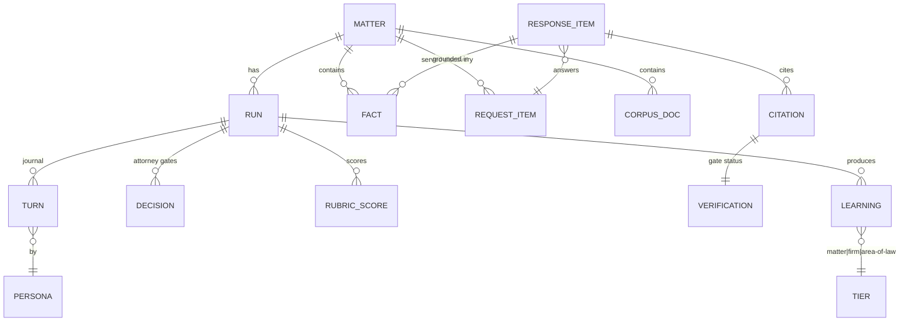

# ✨ feat: MootLoop v1 — Agentic Litigation Pipeline (Discovery Responses)

## Overview

MootLoop is an agentic law firm simulator: six legal personas (Associate, Partner, Opposing-Counsel Associate, Opposing-Counsel Partner, Judge panel, Jury panel) draft, attack, and adjudicate legal work product through rubric-gated iteration loops before a human attorney reads a page. V1 is **Claude Code-native** (agent definitions + skills + a small Python package; Fable orchestrates, Opus subagents perform persona work) and its proving ground is a live lawsuit: producing **discovery responses** (interrogatory answers, RFP responses, RFA responses) end-to-end, with every quality gate the portfolio's hard-won lessons demand.

All 26 brainstorm decisions carry into this plan (see brainstorm: `docs/brainstorms/2026-07-11-mootloop-brainstorm.md`), plus three plan-stage product decisions (P-27..P-29 below) that resolved the gaps spec-flow analysis surfaced.

## Problem Statement

Lawyers using AI as a chatbot get one-shot drafts. The article's thesis ("The Agentic Law Firm") is that iterated, adversarially-tested, panel-adjudicated work product is categorically better — but no OSS system implements the full arc with the guardrails a *real* matter requires: verified citations, zero fabrication, confidentiality boundaries, attorney judgment gates, and auditable traces. MootLoop builds that system, proving it on a real case before generalizing to the full FOLIO task catalog.

Three structural problems the plan must solve (from spec-flow analysis):

1. **Task-shape mismatch:** the persona pipeline was conceived for motions; discovery responses have no pending motion for a Judge to "rule" on. → Solved by **task adapters** (P-27).
2. **Facts are not citations:** interrogatory answers require *client facts with provenance*, not just verified law. → Solved by a **structured fact repository + fabrication gate** distinct from the citation gate.
3. **Attorney judgment is not automatable:** objection posture, privilege calls, and RFA admissions are professional-judgment calls. → Solved by **propose-then-approve attorney gates** (P-28).

## Plan-Stage Decisions (append to brainstorm's 26)

| # | Decision | Choice |
|---|----------|--------|
| P-27 | Panel semantics per task | **Task adapters** define per-task defaults for what panels adjudicate. Discovery default: Judge panel simulates the motion-to-compel / protective-order fight per objection ("would this objection survive?"); Jury panel **off** by default. Users can easily enable more panels (e.g., Jury on discovery) when token/money constraints allow. |
| P-28 | Attorney gates | **Propose-then-approve** default set — (1) objection posture per request type, (2) every privilege call, (3) every RFA admit/deny/qualify, (4) any factual assertion lacking provenance — personas propose with reasoning, attorney approves/modifies. Fully configurable (gates list in `matter.yaml`); autonomous mode batches gates into one review checkpoint. |
| P-29 | Production scope | **Light production help**: MootLoop drafts responses + objections + privilege log AND suggests responsive/non-responsive classification of vault corpus docs per RFP. The attorney makes all production calls; Bates ranges are human-supplied. |

## Proposed Solution

A public OSS repo (`mootloop`) containing persona agents, task adapters, skills, and a deterministic Python core — operating on private **matter vaults** that never touch the repo.

### Repo layout

```
mootloop/
├── .claude/
│   ├── agents/                    # persona subagents (YAML frontmatter + prompt)
│   │   ├── associate.md  partner.md  oc-associate.md  oc-partner.md
│   │   ├── judge.md  juror.md     # parameterized: philosophy / juror profile
│   │   ├── rubric-judge.md        # scores work product against locked rubrics
│   │   └── cite-checker.md        # LLM half of citation/fabrication gates
│   └── skills/
│       ├── moot/SKILL.md          # /moot — run pipeline on a matter task
│       ├── moot-setup/            # /moot:setup — init vault, matter.yaml wizard
│       ├── moot-ingest/           # /moot:ingest — corpus + requests + facts
│       ├── moot-decide/           # /moot:decide — review pending attorney gates
│       ├── moot-status/           # /moot:status — run progress + traces
│       ├── moot-export/           # /moot:export — deliverables + attestation
│       └── moot-learn/            # /moot:learn — edit-diff learning pass
├── AGENTS.md                      # symlinked to CLAUDE.md (house pattern)
├── config/
│   ├── defaults.yaml              # personas, loop caps, budget tiers, run mode, gates
│   ├── tasks/                     # task adapters (see below)
│   │   ├── discovery-responses.yaml
│   │   ├── complaint.yaml  answer.yaml  outgoing-discovery.yaml  motion.yaml
│   └── courts/                    # caption/format templates (user-supplied)
├── personas/                      # prompt bodies: generic-excellence standards
├── rubrics/                       # LOCKED, versioned rubrics per task type
├── playbooks/                     # OSS area-of-law playbooks (scrubbed learnings)
├── src/mootloop/                  # deterministic core (uv + hatchling, src-layout)
│   ├── vault.py                   # vault resolution, matter.yaml schema, run lock
│   ├── journal.py                 # run-state journal (resume), iteration traces
│   ├── requests_parser.py         # served discovery → per-request work items
│   ├── facts.py                   # fact repository, provenance index
│   ├── gates/
│   │   ├── degeneracy.py          # non-empty / non-vacuous assertions per turn
│   │   ├── citations.py           # eyecite + CourtListener/eCFR/GovInfo/Revisor
│   │   ├── fabrication.py         # every assertion traces to facts/ or corpus/
│   │   └── residue.py             # annotation-strip verification at export
│   ├── convergence.py             # copied ConvergenceEvaluator, real deltas
│   ├── budget.py                  # estimate, meter, hard-cap abort, $-equivalent
│   ├── export/                    # md-master → docx / gdoc / memo / audit log
│   ├── learn.py                   # reimport, anchor diff, 3-tier routing, scrub
│   └── cli.py                     # `mootloop` CLI mirror of skills (agent-native parity)
├── tools/                         # copied: evidence-pack/, render-diff.py,
│   │                              #   qa-artifact.py, lane-watch.sh
│   └── privacy_grep.py            # pre-commit vault-leak blocker
├── fixtures/synthetic-matter/     # alea-data-generator demo matter (public-domain only)
├── tests/{unit,integration,property,invariants}/
└── docs/{brainstorms,plans,solutions}/
```

### Matter vault layout (private, e.g. `~/Matters/<matter-id>/`)

```
matter.yaml            # court, caption, parties+roles, our_side, judge, jurisdiction,
                       #   deadlines, enabled personas/panels, gates config, budget tier
corpus/
│   ├── originals/  normalized/   # originals + canonical Markdown
│   └── manifest.json             # per-doc: role tag (complaint|answer|served-discovery|
│                                 #   client-doc|authority), privilege flag, ingest status
facts/                 # structured client facts: {id, statement, provenance[], confidence}
requests/              # parsed incoming discovery: per-request work items (number, type, text)
law/                   # curated authorities (tier-1 citable) + verification cache
runs/<run-id>/
│   ├── journal.json              # resumable coordinator state (persona, loop counters,
│   │                             #   spend, rubric scores) — updated after every turn
│   ├── turns/                    # every persona turn as a readable artifact
│   ├── decisions/                # attorney-gate records (qa-artifact schema)
│   └── scores/                   # rubric-judge outputs, panel distributions
deliverables/          # md-master + exports + strategy memos + audit logs
learnings/             # matter-tier learnings
research-requests/     # Westlaw/Lexis bridge queue (system asks, human fulfills)
```

Firm profile (private, shared across matters, git-private shareable): `~/.mootloop/firm/` — `preferences.yaml`, `style/` (optional style corpus), `learnings/`.

### Execution model

- `/moot <matter> <task>` runs the orchestrator **in the main Claude Code session** (Fable). Persona turns are **Opus subagents** spawned via the Workflow/Agent machinery with structured-output schemas.
- **Task adapter** (`config/tasks/discovery-responses.yaml`) declares: pipeline stages, per-request fan-out, which panels run and what they adjudicate, default attorney gates, rubric id, deliverable set.
- Every turn: write artifact → **non-degeneracy gate** → journal checkpoint. Derailed-subagent detection (zero tool-use, off-persona, schema-violating, or echoed-prompt output) → discard-and-relaunch with counter (never repair).
- Loops: Associate↔Partner capped + convergence-scored; OC pair has its own capped loop; the **outer bolster meta-loop is capped** with an explicit concede-vs-bolster criterion (rubric-judge decides whether OC's surviving attacks warrant concession language instead of another round).
- Fixed stage order: converge → Judge panel → restructure (a costed Associate iteration) → optional Jury → strategy memo.
- Run modes: `autonomous` (gates batched at end), `gated` (pause at checkpoints), `observed` (STATUS file + lane-watch streaming, interruptible). Per-matter run lock prevents concurrent runs corrupting vault state.

### Quality-gate stack (the "green check is not proof of work" architecture)

| Gate | Type | When |
|---|---|---|
| Non-degeneracy (non-empty, per-request coverage, no vacuous convergence) | deterministic | every turn |
| Citation gate (eyecite extract → verify: CourtListener 200/404/400 semantics; eCFR/GovInfo/FR; MN Revisor scrape; cached, rate-limit queue) | deterministic + LLM proposition check | before any citation enters work product |
| Fabrication gate (every factual assertion traces to `facts/` or `corpus/`; generators denied non-substantive input) | deterministic | every drafting turn |
| Rubric gate (LOCKED versioned rubrics; 3 independent rubric-judge subagents; numeric-native, rendered to evidence-pack at boundary) | LLM panel | loop convergence + final |
| Attorney gates (P-28 propose-then-approve) | human | per task-adapter config |
| Confidentiality preflight (vault-boundary check; folio-enrich localhost-only assert; endpoint allowlist; **no matter data in web-search lane**) | deterministic | before every run |
| Privacy-grep (vault-leak blocker; gitleaks) | deterministic | pre-commit, OSS repo |
| Annotation-residue scan | deterministic | at export |
| Attestation (DRAFT watermark until "reviewed by [name]"; invalidated by post-attestation edits; separate from client verification oath) | human + deterministic | clean export |
| Budget hard cap (pre-spend abort from actual returned tokens; at-cap = graceful checkpoint + partial deliverable + gaps memo) | deterministic | continuous |

### Core entities



## Technical Approach — Implementation Phases

> Effort is in focused sessions (~half-day units). Phases 0–2 are the critical path to first end-to-end run; 3–7 harden it to court-usable; 8–9 close the compounding loop and validate.

### Phase 0: Scaffold & guardrails (2 sessions)

- Repo scaffold: uv + hatchling, `src/mootloop/`, Python 3.12, ruff (line 100), mypy-strict authoritative, pytest tiers incl. `tests/invariants/`; Makefile; `AGENTS.md` ⇄ `CLAUDE.md` symlink; README skeleton; THIRD-PARTY.md
- `vault.py`: matter.yaml pydantic schema (court, caption, parties+roles, **our_side**, judge, jurisdiction, deadlines, personas/panels, gates, budget tier) + validation errors that name the missing field; per-matter run lock (`runs/.lock`)
- `tools/privacy_grep.py` + pre-commit (ruff, gitleaks, privacy-grep); CI invariant: fixtures contain zero real-matter strings
- **Success:** `mootloop init` (and `/moot:setup`) creates a valid empty vault; pre-commit blocks a seeded fake leak; all checks green on empty package.

### Phase 1: Ingestion, requests, facts (3 sessions)

- `/moot:ingest`: folder walk → folio-enrich (**localhost-only assert**) with doc-to-markdown fallback → `corpus/normalized/` + `manifest.json`; failure surfacing (OCR-needed, password, corrupt, oversized) as a user action list
- Role tagging + privilege flagging at ingest (interactive confirm; stored in manifest)
- `requests_parser.py`: served discovery → numbered `REQUEST_ITEM`s (interrogatory | RFP | RFA), each a work unit
- `facts.py` + fact-interview flow in `/moot:ingest`: structured facts with provenance links into corpus; gap questions generated per unanswered element (alea-intake question-gen pattern)
- `fixtures/synthetic-matter/`: alea-data-generator-built demo matter (public-domain/synthetic only)
- **Success:** Damien's organized case folder ingests clean; served discovery parses to the correct request count; fact repository populated; synthetic matter passes the same path in CI.

### Phase 2: Thin full pipeline (4 sessions)

- Six persona agent definitions + `rubric-judge` + `cite-checker` (frontmatter + generic-excellence prompt bodies; parameterized judge philosophy / juror profile)
- `config/tasks/discovery-responses.yaml` task adapter (P-27 defaults) + `defaults.yaml`
- `/moot` orchestrator: per-request fan-out, Associate→Partner loop (cap 2 in thin mode), OC loop (cap 1), Judge adapter stub, deliverable assembly; **autonomous mode only**
- `journal.py`: run-state checkpoint after every turn; `/moot` resumes from journal; idempotent turns (discard partial, relaunch)
- Derailment detection + discard-and-relaunch; non-degeneracy gate v1 (every request has a non-empty response object)
- **Success:** full pipeline runs end-to-end on the synthetic matter, producing a per-request draft + trace tree; kill −9 mid-run resumes to identical output.

### Phase 3: Convergence, rubrics, budget (3 sessions)

- Copy `ConvergenceEvaluator` + scoring from alea-intake (`backend/app/services/analysis/convergence.py`, `scoring.py`); wire **real** rubric-score deltas (not the hardcoded 0.05 gotcha)
- Author + **LOCK** `rubrics/discovery-responses-v1.0.yaml` (completeness per request, objection basis stated, fact-provenance, citation status, strategic coherence; "present" and "correct" as separate criteria); 3 independent rubric-judges, majority-carry
- `budget.py`: pre-run estimate (per-persona cost × iteration caps, shown as a range), live metering from actual returned tokens, tokens + $-equivalent display, **hard cap with graceful at-cap checkpoint** (partial deliverable + gaps memo)
- **Success:** loops terminate by convergence (not just caps) on synthetic matter; a deliberately low cap produces a graceful partial with an honest gaps memo; degenerate (empty-input) run FAILS loudly.

### Phase 4: Citation & fabrication gates (3 sessions)

- `gates/citations.py`: local eyecite extraction; CourtListener v4 `citation-lookup` (token auth, 60-cites/min queue, 250/request chunking) → 200 verified / 404 unconfirmed-flag / 400 reject; opinion text pull for LLM proposition check; eCFR (keyless, point-in-time) / GovInfo USCODE / Federal Register clients; MN Revisor scraper (statutes + court rules, stable URLs); persistent verification cache in `law/`
- `gates/fabrication.py`: every factual assertion in a response must anchor to a `FACT` or corpus passage; evidence-existence hedging (alea-intake `rationale_guard` pattern); unverifiable assertions become attorney-gate items (P-28 #4)
- `research-requests/` queue: citations needing Westlaw/Lexis get a structured request the human fulfills into `law/`
- **Success:** a planted fake citation is rejected with status trail; a planted unsupported "fact" is caught; verified-cite cache prevents duplicate API hits across runs.

### Phase 5: Attorney gates & run modes (2 sessions)

- `DECISION` objects (qa-artifact schema): persona proposal + reasoning + options; `/moot:decide` review UI-in-terminal; decisions recorded in `runs/<id>/decisions/` and fed back into the loop
- `gated` mode (pause at checkpoints) and `observed` mode (STATUS-file streaming + lane-watch; `STATE:` markers per house convention)
- Configurable gates list in matter.yaml with P-28 defaults
- **Success:** an RFA run pauses on every admit/deny in gated mode; autonomous mode batches the same items into one `/moot:decide` session; nothing exports with unresolved gates.

### Phase 6: Panels (3 sessions)

- Judge discovery-adapter: per objection, N judges rule "survives motion to compel?" with reasoning; distribution report; restructure pass re-enters Associate as a **costed** iteration
- Jury persuasion panel (off by default for discovery, easily enabled): lay readthrough scores per response
- Calibrated-judge builder: pull assigned judge's opinions via CourtListener → persona corpus; non-US jurisdiction warning at config time
- Panel-size × budget-tier defaults (no-budget: 10 judges; moderate: 5; low: 3)
- **Success:** objection-survival distribution visibly reorders/rewrites weak objections on the synthetic matter; calibrated-judge persona builds from a real judge's opinions.

### Phase 7: Deliverables, export, attestation (3 sessions)

- Markdown master with **stable passage anchors** (per-request response IDs — the anchor scheme also serves Phase 8)
- Copy alea-intake `ExportAdapter` + DOCX adapter; court caption template for Damien's court in `config/courts/`; annotated-draft render (confidence, verification status, persona attribution) that **strips on export + residue scan**
- Google Doc export via Drive API/MCP; strategy memo generator (objection strategy, risk flags per response, panel odds, OC findings); privilege log; interrogatory verification page (client oath — separate from attorney attestation); signature blocks
- Attestation flow: DRAFT watermark until recorded attestation; post-attestation edit invalidates; AI-use audit log export (per-passage attribution, per-citation status, models, timestamps)
- **Success:** one command emits DOCX + Google Doc + memo + privilege log + audit log; watermark only clears with attestation + green citation gate; residue scan finds zero annotations in the filed copy.

### Phase 8: Edit-learning loop (3 sessions)

- Reimport: edited DOCX / Google Doc → normalized MD → word-level diff (render-diff.py) against passage anchors; GDoc comment pull with comment-anchor→passage resolution
- Learning classifier (propose tier: matter / firm / area-of-law; human confirms); firm-profile merge semantics (shared store, ID-keyed writes); area-of-law scrub + privacy-grep gate before anything lands in OSS `playbooks/`
- Optional style-corpus ingestion into firm profile
- **Success:** a round-trip edited DOCX produces correctly-anchored diffs and tier-routed learnings; a seeded client-fact in a proposed playbook contribution is blocked by the scrub gate.

### Phase 9: Benchmark & live validation (3 sessions + ongoing)

- Hidden answer keys (ANSWER-KEYS pattern) for the synthetic matter — persona regression oracle in CI
- **Hand-draft benchmark:** run complaint / answer / outgoing-discovery task adapters against Damien's real matter; evidence-pack per run; success = Damien judges MootLoop output equal-or-better
- **Live run:** discovery responses on the real case through the full gate stack; edits feed Phase 8; lessons feed `docs/solutions/`
- **Success:** benchmark verdict recorded; real discovery responses served (after human attestation); ≥1 compounding-loop cycle completed.

## Alternative Approaches Considered

- **Standalone Agent SDK app first** — rejected for v1: slower to first real deliverable, loses free seat-based-plan support; remains the extraction target (brainstorm D-3).
- **Extend alea-intake instead of a new repo** — rejected: alea-intake is an A2J intake platform with a different privacy/product posture; MootLoop copies its pure components (convergence, export) and calls its siblings as services instead.
- **OpenLaws as single law-API vendor** — deferred: spans statutes+regs+cases but is sales-gated with no free tier; the CourtListener+GovInfo+eCFR+Revisor stack is free and adequate for v1 (noted as consolidation option).
- **Deep Associate↔Partner loop before other personas** — rejected per brainstorm D-6 (thin-full default), retained as a user-selectable pipeline strategy.

## System-Wide Impact

### Interaction graph
`/moot` → task adapter → per-request fan-out → persona subagent turns → (each turn) degeneracy gate → journal write → convergence check → next stage. Citation gate calls external APIs (queued/cached) → verification ledger → rubric judges read ledger → attorney gates read proposals → export reads gates' aggregate state. Learning pass reads deliverable diffs → writes to vault/firm-profile/playbooks (three different trust zones).

### Error & failure propagation
- Subagent failure/derailment → discard-and-relaunch (counter-capped) → after N failures, run pauses with journal intact — never silently absorbed.
- External API failures (CourtListener 429/timeouts) → queue backoff; citation stays "unverified" (blocking state), never silently passes.
- Budget-cap breach mid-loop → graceful checkpoint path, not exception unwind.
- Gate failures are **terminal states for the artifact, not the run**: work product carries its gate ledger; export is where unresolved states block.

### State lifecycle risks
- Partial persona turn → journal only records completed turns; turn artifacts are write-once, ID-keyed (no clobber).
- Concurrent runs → per-matter lock; firm-profile concurrent learnings → ID-keyed merge (lane-3 concurrency lessons).
- Attestation state → invalidated by any later edit to the master (hash check).
- Vault/repo boundary → preflight + pre-commit + scrub gates at every crossing point.

### API surface parity
Every skill has a CLI mirror (`mootloop init|ingest|run|decide|export|learn|status`) so both humans and non-Claude agents can drive it; skills and CLI share `src/mootloop/` code paths (agent-native parity).

### Integration test scenarios
1. Kill −9 mid-OC-loop → resume → byte-identical final deliverable.
2. Served discovery with a compound interrogatory (subparts) → parser produces subpart work items → each answered.
3. Planted hallucinated citation + planted unsupported fact → both blocked, both appear in attorney-gate queue with correct provenance trails.
4. Budget cap set below estimate → run refuses to start; cap hit mid-run → partial deliverable + gaps memo, journal resumable after cap raise.
5. Full export → reimport with edits + a GDoc comment → diffs anchor to the right passages → learnings route to correct tiers → playbook contribution with seeded client fact is blocked.

## Acceptance Criteria

### Functional
- [ ] `mootloop init` / `/moot:setup` creates a valid vault; matter.yaml schema-validated with our_side, judge, deadlines
- [ ] Ingestion handles Damien's real case folder: manifest with role tags + privilege flags; unreadable docs surfaced
- [ ] Served rogs/RFPs/RFAs parse into numbered per-request work items (subparts included)
- [ ] Thin full pipeline produces per-request responses + objections + privilege log + strategy memo on synthetic matter
- [ ] All six personas individually enable/bypass-able; pipeline strategies thin-full / deep-core / adversarial-first selectable
- [ ] Convergence terminates loops via locked rubric deltas; iteration caps user-configurable
- [ ] Citation gate: 200/404/400 semantics enforced; nothing unverified exports; research-request queue works
- [ ] Fabrication gate: assertions without fact/corpus provenance blocked or gated to attorney
- [ ] Attorney gates (P-28 set) function in all three run modes; decisions recorded
- [ ] Judge discovery-adapter produces objection-survival distributions that drive a restructure pass
- [ ] Export: DOCX (court caption) + Google Doc + memo + annotated draft; DRAFT watermark until attestation; residue scan clean; AI-use audit log emitted
- [ ] Edit-learning round-trip: DOCX/GDoc edits → anchored diffs → tier-routed learnings; scrub gate blocks client facts from playbooks
- [ ] RFP light-production help: responsive/non-responsive suggestions per request
- [ ] Hand-draft benchmark run + judged; live discovery responses produced through full gate stack

### Non-functional
- [ ] Zero matter data in the OSS repo — privacy-grep + gitleaks pre-commit, CI invariant on fixtures
- [ ] folio-enrich called localhost-only; endpoint allowlist preflight; no matter data in web-search lane
- [ ] Any run resumable after crash/interrupt from journal
- [ ] Budget: pre-run range estimate, live tokens + $-equivalent, hard cap honored
- [ ] Derailed subagents auto-detected and relaunched, never repaired

### Quality gates
- [ ] mypy-strict + ruff clean; pytest tiers green including invariants
- [ ] Rubrics locked + versioned before any convergence loop runs
- [ ] Hidden answer keys in CI for persona regression
- [ ] README + AGENTS.md current at every ship; THIRD-PARTY.md complete

## Success Metrics

- **Primary:** Damien judges MootLoop's discovery responses equal-or-better than his hand drafts would have been, and serves them (after attestation) in the live case.
- Rubric scores climb across iterations (expect a real climb, not one-shot pass — portfolio history: 0.38→0.83 over rounds).
- Zero fabricated citations/facts reach any export (hard requirement, not a metric to optimize).
- ≥1 full compounding cycle: edits → learnings → measurably better next run.
- Cost per full pipeline run lands within the pre-run estimate range.

## Dependencies & Prerequisites

- **Copy:** alea-intake `convergence.py` + `scoring.py`; `output/export/base.py` + `docx_adapter.py`; `tools/{evidence-pack,render-diff.py,qa-artifact.py,lane-watch.sh}` (log all in THIRD-PARTY.md)
- **Services:** folio-enrich (localhost; spaCy model + FOLIO OWL fetch on first run); FOLIO MCP (`uvx folio-mcp`)
- **Libraries:** folio-python, eyecite, python-docx, alea-data-generator (fixtures), nupunkt (sentence segmentation for diff granularity)
- **APIs/keys:** CourtListener token (free account; consider FLP membership for rate limits), api.data.gov key (GovInfo), Google Drive/Docs (existing MCP); eCFR/Federal Register keyless
- **Damien-supplied:** case folder path, served discovery documents, court caption template, objection-posture preferences, CourtListener + api.data.gov keys

## Risk Analysis & Mitigation

| Risk | Mitigation |
|---|---|
| Trivial convergence / "converging on nothing" | Deterministic non-degeneracy gates per turn + live smoke test per model seam + planted-failure integration tests |
| Fabricated authority or facts reaching a filing | Dual gates (citation + fabrication) as blocking states; attorney gate as backstop; attestation required |
| CourtListener rate limits stall runs | Local eyecite pre-extraction; persistent cache; queue with backoff; curated `law/` corpus as tier-1 avoids re-verification |
| MN Revisor scraper breaks (no API) | Stable-URL scrape + cached copies in `law/`; failures degrade to research-request queue |
| Confidentiality leak vault→repo | Preflight + pre-commit privacy-grep + scrub gate + CI invariant (four independent layers) |
| Orchestrator context exhaustion on long runs | Journal-checkpoint architecture; per-request fan-out keeps persona contexts small; resume designed-in from Phase 2 |
| Persona cross-domain contamination | Task-adapter-scoped prompts; hidden answer keys assert personas surface only their domain |
| Cost blowout on panels | Panel sizes bound to budget tiers; hard cap with graceful checkpoint; bake-off cheapest-model-that-clears for judges |
| GDoc/DOCX reimport noise corrupting learnings | Passage anchors + normalization + human-confirmed tier routing |

## Resource Requirements

~29 focused sessions across 10 phases (0–9); solo developer + Claude Code; runs on existing Claude plan (seat-based) with optional API keys for panel scale-out. External accounts: CourtListener, api.data.gov (both free).

## Future Considerations

- Agent SDK extraction (brainstorm D-3) once loops validated; alea-llm-client as provider layer
- Claude Code plugin packaging (folio-claude-plugin precedent) for `/plugin install mootloop`
- Full FOLIO task-catalog adapters (motions, briefs, appeals); deliberating jury + Monte Carlo panel composition (D-13)
- Multi-operator firm profiles with real merge semantics; alea-legal-benchmark-style persona benchmark suite
- OpenLaws consolidation if free-stack maintenance grows

## Documentation Plan

- README (purpose, personas, quickstart, config reference) — current at every ship
- AGENTS.md/CLAUDE.md (setup, commands, architecture, vault boundary rules)
- `docs/ethics.md` — UPL framing, supervision duties, AI-disclosure posture
- `docs/solutions/` entries as lessons emerge (compounding)
- THIRD-PARTY.md — every copied/imported OSS component

## Sources & References

### Origin
- **Brainstorm:** [docs/brainstorms/2026-07-11-mootloop-brainstorm.md](../brainstorms/2026-07-11-mootloop-brainstorm.md) — all 26 decisions carried forward; key: task-agnostic persona pipeline (D-5/6), vault boundary (D-14/16), edit-learning tiers (D-21/23), guardrails (D-25)

### Internal references
- Convergence: `alea-intake/backend/app/services/analysis/convergence.py:12,37`; scoring: `scoring.py:12` (copy; wire real deltas — orchestrator.py:625 gotcha)
- DOCX export: `alea-intake/backend/app/services/output/export/{base,docx_adapter}.py` (copy)
- Ingestion service: `folio-enrich/backend/app/api/routes/enrich.py:87` (`content` field, not `"text"` — README stale); formats: `app/models/document.py:14-22`
- Judged artifacts: `tools/evidence-pack/generate.py:441-446` + `briefs/qa/SCHEMA.md`; diffs: `tools/render-diff.py`; observability: `tools/lane-watch.sh`
- Persona-state precedent: `clio-skills/SKILL_ Analyze Adverse Document.md` (PERSISTENT SYSTEM FILES pattern)
- Orchestration lessons: `CHRONICLE.md`, `HANDOFF.md`, `briefs/STATUS-lane-3.md` (derailment, phantom-waiter, rubric-lock, answer keys, concurrency)
- Fabrication/degeneracy lessons: `alea-intake/docs/solutions/live-validation-unit-green-integration-dead.md`; `folio-insights/docs/solutions/heading-as-unit-fabrication.md`; `generative-folio/docs/solutions/evals/hydration-model-bakeoff-and-judging.md`

### External references
- CourtListener v4: https://www.courtlistener.com/help/api/rest/ · citation-lookup: https://wiki.free.law/c/courtlistener/help/api/rest/v4/citation-lookup
- GovInfo: https://api.govinfo.gov/docs/ · eCFR: https://www.ecfr.gov/developers/documentation/api/v1 · Federal Register: https://www.federalregister.gov/developers/documentation/api/v1
- MN Revisor: https://www.revisor.mn.gov/statutes/ · https://www.revisor.mn.gov/court_rules/
- ALEA org reuse: alea-llm-client, alea-data-generator, folio-claude-plugin, alea-legal-benchmark, nupunkt — https://github.com/alea-institute/

### Related work
- Spec-flow analysis: 30 findings, all addressed above (structural: task adapters P-27, fact repository, attorney gates P-28, passage anchors)
