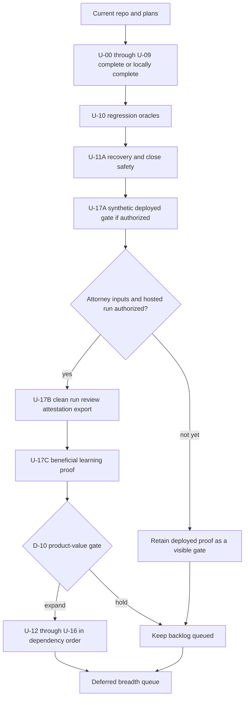

# Complete and Validate MootLoop's Open Plan Queue

## Goal Capsule

Turn every unfinished commitment in the repository's three historical plans into an
evidence-backed, dependency-ordered queue; finish autonomous work through repeated
`ce-work` sessions; and keep attorney judgment, privileged matter access, OAuth
consent, spend authorization, and production changes behind explicit human decisions.

## Product Contract

### Problem

The repository has two legacy plans marked active, stale checkboxes that understate
completed work, broad post-first-serve features that were never implemented, and a
partial hosted run that cannot count as clean legal validation. At audit start, resumed
runs also reloaded mutable context; completed U-01 now freezes the approved launch
inputs, assembles bounded context, and recovers interrupted hosted launch delivery.

### Primary Users

- The human attorney who must understand and approve substantive legal and operational
  gates without reading implementation archaeology.
- An implementation agent that needs bounded units, file ownership, invariants, and
  verification commands across multiple sessions.
- Future maintainers who need a durable explanation of why work was completed,
  deferred, or held for a decision.

### Desired Outcomes

1. Every historical plan task has a canonical disposition in the companion audit.
2. Resumed runs bind the exact approved input context or fail closed.
3. Hosted execution enforces isolation and outbound confidentiality rather than merely
   exposing optional seams.
4. The remaining v1 compounding loop and cockpit phases land through shared services
   with CLI/API/UI parity, durable state, and recoverable jobs.
5. A clean synthetic deployed gate precedes any newly authorized real-matter run.

### Non-Goals

- Reading or modifying a hosted matter without a Decision Sheet authorization.
- Recording substantive attorney approvals on the attorney's behalf.
- Production deployment, OAuth consent, credential rotation, or uncapped model spend.
- Pulling Dropbox/OneDrive, Web Push, multiplayer, UTBMS, or broad `pipeline_shape`
  work forward before core safety and validation gates.
- Restoring opaque matter IDs; the current readable timeline-leading convention in
  `AGENTS.md` supersedes the older hosted-plan wording.

### Constraints

- All vault writes pass through `safe_vault_path`; new stores are versioned or
  append-only and registered with close-out inventory.
- Matter data never enters the repository, fixtures, logs, notifications, or tests.
- The core remains synchronous; external clients and job fan-out receive bounded async
  facades only where needed.
- Human-only acts remain human-only: task/rubric lock, privilege/RFA decisions,
  attestation, OAuth consent, and failover or cap authorization.
- New interactive surfaces follow service primitive → CLI → API → UI. Node/Next stays
  a thin proxy.
- Every outbound channel passes one fail-closed canary/redaction choke point.

### Success Signals

- Backend `make check` and `make -C frontend check` pass locally and in CI.
- Every current capability-matrix row has equivalent durable outcome, actor,
  provenance, and audit behavior through its supported interfaces.
- Mutating any run input after start either reproduces the exact snapshot or blocks
  resume with an actionable drift error.
- Kill/retry tests prove idempotent recovery for every new long-running job.
- Cross-matter and hostile-content tests prove no context or instruction leakage.
- An authorized clean run completes start → decisions → attestation → export, followed
  by one edit → accepted learning → attorney-confirmed improvement with no material
  quality or confidentiality regression.

## Planning Contract

### Assumptions

- Scoping confirmation is intentionally skipped because the user requested autonomous
  progress. The strict recent-plan window is 2026-07-30 through 2026-08-20 in
  America/Chicago.
- Before this reconciliation created the current continuation plan, that strict search
  found zero created or modified plan artifacts. A later all-history search of the
  workspace, refs/tags, reflogs, deleted paths, and recoverable unreachable commits
  confirmed that the same three July plans are the complete original `ce-plan` corpus.
  “All plans” also includes their D1–D13/FD-1–FD-10 amendments plus plan-like
  obligations recorded in the recent audit, handoff, and merged PR descriptions.
- Local code, Git history, deployment evidence already committed to the repository,
  and current tests are sufficient for planning; no external research is needed.
- Hosted data and operations remain out of scope until the corresponding D-series
  choice is made in the Decision Sheet.
- Context changes force a new run by default. A future journaled rebase may be planned
  only after an explicit attorney policy decision.

### Scope

**Pre-validation now:** plan truth/CI, canonical config/migration contracts, exact
context binding, isolation/outbound controls, integrity, ingest/fact preparation, local
edit-learning, and the synthetic/authorized clean-run gates. This is the smallest path
that can prove start → decision → attestation → export → beneficial learning.

**Post-validation queue:** v1 configurability/gates, proposition checking/panels, RFP
assistance, regression oracles, parity, FE-3 through FE-6, and measured performance
work. D-10 decides whether clean-run evidence gates this expansion; option A is the
safe default.

**Decision-gated:** deployed proof, private-folder review, real-matter re-drive,
attorney decisions/facts/attestation, Google OAuth/Docs/Drive, production maintenance,
and historical hosted-content forensics.

**Later:** non-discovery breadth, broad `pipeline_shape`, Dropbox/OneDrive, Web Push,
multiplayer, UTBMS, and a generic fallback adapter.

### Requirements

- **R-01 Traceability:** every original task maps to `COMPLETE`, an implementation
  unit, a D-series decision, or an explicit later queue.
- **R-02 Reproducibility:** each run pins all effective input versions and hashes.
- **R-03 Confidentiality:** execution and outbound channels enforce trust boundaries.
- **R-04 Integrity:** attestations bind the complete review/export state and durable
  logs expose tampering.
- **R-05 Agent parity:** every new action has shared semantics across supported
  service/CLI/API/UI surfaces.
- **R-06 Recoverability:** every new job is idempotent, journaled, cancellable where
  safe, and reopenable after interruption.
- **R-07 Human control:** agents may propose but never self-record protected decisions.
- **R-08 Evidence:** tests demonstrate outcomes and failure behavior, not only shape.

### Technical Defaults

- Configuration resolves from lowest to highest as `defaults.yaml` → task adapter →
  firm preferences → `matter.yaml` → invocation flags. Adapter-owned structural fields
  cannot be overridden outside an explicit allowlist.
- A launch-context manifest is immutable. Human decisions append journal-bound runtime
  commitments; they do not rewrite launch inputs. New or revised facts, requests,
  corpus, policies, rubrics, board material, or learnings require a new run.
- Hosted protected writes are performed through the Access-authenticated API. A hosted
  CLI cannot accept a caller-supplied actor. Offline protected CLI use must derive the
  actor from an authenticated local OS principal and record the channel.
- Per-matter isolation is a non-negotiable outcome. U-02 begins with an ADR and hostile
  spike comparing least-privilege mounts/process identities with per-matter containers;
  the selected topology must prevent sibling reads and route provider traffic through
  a destination-allowlisting broker.
- FOLIO catalog use is from a pinned, locally readable, license-reviewed release with a
  version/content manifest. No task depends on a live catalog service at run time.
- Notifications contain only event category, severity, and timestamp. They contain no
  matter/run IDs, client-derived names, filenames, blocker text, or identifier-bearing
  URLs.

### Decision Gate Index

- **D-01:** quarantine/re-drive policy for suspect hosted turns.
- **D-02:** readiness to supply protected attorney inputs.
- **D-03:** authorized hosted/deployment access scope.
- **D-04:** completion target for protected ingest failures.
- **D-05:** converter direction.
- **D-06:** Google Drive/Docs timing and consent.
- **D-07:** post-merge operational monitoring closure.
- **D-08:** production housekeeping scope.
- **D-09:** off-vault integrity anchor and signing-key custody.
- **D-10:** clean-run product-value gate before backlog expansion.
- **D-11:** authenticated Confirm semantics for the human TaskSpec lock.
- **D-12:** approved FOLIO release, license evidence, and local manifest contract.
- **D-13:** authorization to publish the current uncommitted work and obtain remote CI.
- **D-14:** literal `source_matter_id` fields versus approved vault-boundary equivalence.
- **D-15:** new-run-only context changes versus an explicit invalidating rebase.
- **D-16:** post-validation ordering of adapter/panel breadth versus FE-3–FE-6.
- **D-17:** whether currently deferred integrations enter the next milestone.

The full choices and recommended defaults are in
`docs/decisions/2026-08-20-plan-completion-decision-sheet.md`.

### Human-Tech Decision Map



## Current-State Findings That Govern Sequence

- The completed demo plan stays closed.
- FE-0 infrastructure and perimeter checkboxes are complete. U-02 also closes the two
  local sandbox gaps: hosted provider turns require the built-in Landlock wrapper,
  each worker mounts only one matter, and provider traffic crosses an authenticated
  destination-allowlisting proxy. Deployed hostile proof remains U-17A behind D-03.
- The prior hosted run proved provider/queue/spend plumbing, but it stopped in
  `needs_attention`, loaded no verified client facts, and occurred during the blind
  persona-context window. It does not satisfy clean live validation.
- At audit start, `RunStarted` did not bind the complete input snapshot. U-01 now binds
  TaskSpec, adapter/rubric, request/fact/policy, corpus, approved board/learning, and
  persona inputs; canonical config, migrations, TaskSpec locks, context assembly, and
  journaled launch outbox recovery are complete.
- At audit start, GitHub CI ran backend only and lacked a BFF-thin invariant. U-00 is
  complete locally and remotely: PR #32 proved backend, invariant, frontend, OpenAPI,
  generated-client, production-build, and BFF-thin gates.
- Current export is court-usable in its local DOCX lane, but edit-learning, Google
  round-trip, RFP production help, and answer-key regression remain absent.
- FE-2 and thin FE-2.5 are shipped; FE-3 through FE-6 remain materially open.

## Unit Index

| Unit | Outcome | Depends on | Decision gate |
|---|---|---|---|
| U-00 | Plan truth, current README, frontend/OpenAPI/BFF CI | none | none |
| U-01 | Pre-validation: canonical config/migrations, Run Context Manifest, context assembly | U-00 | D-11 TaskSpec-lock semantics; launch changes require new run |
| U-02 | Pre-validation: enforced egress/per-matter isolation and outbound tripwire | U-01 | deployed proof requires D-03 |
| U-03 | Pre-validation: complete integrity and attestation commitment | U-01 | off-vault anchor D-09 |
| U-04A | Pre-validation: synthetic ingest classifications, fact review, provenance, gaps, and visibility exclusions | U-01 | none |
| U-04B | Pre-validation: isolated converter and protected-folder closure | U-02, U-04A | private review D-04; converter D-05 |
| U-05 | Post-validation: gate protocol, remaining ID discipline, and CLI package cleanup | U-01 | D-10 expansion gate |
| U-06 | Post-validation: persona enable/bypass and pipeline strategies | U-05 | D-10 expansion gate |
| U-07 | COMPLETE locally: citation proposition checking and remaining panels | U-05 | Hosted legal-source proxy expansion D-18 |
| U-08 | COMPLETE: RFP production-suggestion workflow | U-04A, U-05 | D-10 expansion gate |
| U-09 | COMPLETE locally: DOCX parser proof, edit-learning, and next-run readback | U-01, U-03, U-04A | attorney before/after verdict U-17C; Google lane D-06 |
| U-10 | Post-validation: hidden answer-key and benchmark harness | U-06, U-07 | D-10; human verdict D-02/D-03 |
| U-11A | Pre-validation: concrete recovery gaps, matter-close safety, parity foundation, required docs | U-01, U-03 | D-14 source binding; publication remains D-13 |
| U-11B | Post-validation: common durable-job lifecycle extraction and full capability breadth | U-11A, U-12, U-13 | D-10 expansion gate |
| U-12 | Post-validation: FE-3 catalog, on-ramps, synthesis, rubric lock | U-01, U-11A | D-10; FOLIO acquisition D-12 |
| U-13 | Post-validation: FE-4 durable strategy board and approve-then-inject | U-12 | D-10 expansion gate |
| U-14 | Post-validation: FE-5 upload/triage/suggestions; optional Drive/deadlines | U-11A, U-13 | D-10; Google D-06 |
| U-15 | Post-validation: FE-6 dashboard/audit/notifications and bounded failover | U-02, U-11A, U-14 | D-10; failover authority human |
| U-16 | Post-validation: metrics-gated concurrency/caching/batching | U-03, U-11A | D-03 paid calibration; D-10 expansion |
| U-17A | Synthetic isolation/restore/perimeter/browser proof | U-02, U-11A | D-03 |
| U-17B | Clean real-matter review/attestation/export proof | U-01–U-04A, U-11A, U-17A; U-04B when protected-folder closure is in scope | D-01, D-02, D-03, D-04, D-07 |
| U-17C | Beneficial learning readback proof | U-09, U-17B | D-02, D-03 |
| U-18 | Publish reviewed work and record remote CI/merge disposition | completed local units | D-13 |

## Execution Status — updated 2026-08-21

- **U-00 COMPLETE.** README provider claims are corrected. CI now runs the
  backend-generated OpenAPI drift check plus frontend install, lint, typecheck, tests,
  generated-client drift, production build, and both lexical and TypeScript-AST BFF
  boundary tests. PR #32 merged after its backend, invariant, and frontend jobs passed
  remotely on code head `d64960c`.
- **U-01 COMPLETE.** New runs persist a write-once,
  versioned manifest plus a separately hashed corpus snapshot. It binds the TaskSpec,
  adapter configuration and resolved behavior, persona bodies, locked rubric, request
  sets, folded facts, matter policy, retry ceiling, tier models, corpus inventory/content,
  and byte-derived provenance. Lifecycle, decisions, attestation, panels, demo/API views,
  gates, prompts, and exports either replay that context or fail closed. Provider results
  rebind context before protected writes; every lifecycle read verifies the corpus digest;
  snapshot size/retained-storage ceilings are enforced; and historical pre-manifest
  runs remain readable as non-replayable status records. Five-layer resolved config,
  in-memory schema migrations, manifest-bound canonical IDs, exact append-only human
  TaskSpec locks, approval-filtered board/learning/context contributions, and the
  permission-filtered DATA-fenced context assembler are implemented. Hosted launches
  journal a deterministic outbox intent atomically, and bounded recovery repairs queue
  delivery without resurrecting a terminal run. Content-addressed corpus deduplication
  remains a storage optimization, not an unmet U-01 safety contract.
- **U-02 COMPLETE locally and in CI.** Hosted execution is bound to one exact matter
  vault per worker; queue claim/recovery is matter-filtered; the hosted provider
  requires the built-in Landlock wrapper; and the persona process cannot read its
  matter vault, queue metadata, secrets, or canary registry. Its only network reaches
  an authenticated Squid CONNECT proxy allowlisted to the model endpoint. Prompts,
  SSE, and notifications share one fail-closed outbound privacy serializer. The trusted
  launcher validates fixed bind sources, including a private persistent per-matter
  Claude-state directory so resumed sessions survive worker replacement. The local
  non-root image probe, Compose validation, review gates, and remote CI passed. U-17A's
  deployed network/direct-egress/ACL/kill/cross-matter proof remains D-03-gated and is
  not claimed by U-02.
- **U-03 local integrity core COMPLETE.** The human v2 attestation requires an existing
  attorney-reviewed draft and commits that exact court master, citation ledger, run
  journal and turn evidence, decision log and
  sidecars, launch fact state, intact access-audit prefix, reviewer, and timestamp.
  Clean export appends a linked exact-byte artifact seal; every download/list path
  revalidates it, and any single-byte bound-state drift re-imposes DRAFT. JSONL stores
  use locked, fsync'd append with torn-tail recovery; no-follow stable-descriptor
  hashing fails closed on symlinks or concurrent mutation. Legacy attestations remain
  readable but cannot satisfy the v2 contract. The same read-only integrity status is
  exposed through service, CLI JSON, API, and UI. U-09 now supplies the local anchored
  edit artifact; expanding the attestation/export seal to annotated-draft variants is
  retained in the successor queue. D-09 still needs a concrete immutable remote
  signed-head provider before coordinated host-writer resistance can be claimed.
- **U-04A COMPLETE locally and in CI.** Mixed-format ingest now emits deterministic protected
  actions for OCR, password, corrupt, unsupported, unreadable, oversized, role, and
  privilege work. Original files are captured through stable no-follow descriptors;
  manifest mutations and append-only fact review transitions are process-safe and
  durable. Only normalized role/privilege-reviewed documents and accepted facts enter
  immutable run context. Pending revisions preserve the reviewed predecessor until
  acceptance, provenance acceptance verifies an exact quote in a reviewed document,
  and deterministic interviews surface review, support, repair, and uncovered-document
  gaps. Empty or wholly unreviewed ingests fail before run creation. Legacy manifests
  also retain a conservative remedy for every non-runnable terminal state.
- **U-04B is COMPLETE locally, remotely reviewed, and merged for the converter code
  and synthetic tests, with its deployed/protected evidence tail still gated by U-17A
  and fresh D-03 authorization.**
- **U-05 COMPLETE locally, remotely reviewed, and merged.** The uniform gate catalog
  validates canonical names, dependencies, cycles, and deterministic execution;
  historical runs retain the previously implicit fabrication gate. Stage inputs are
  detached from mutable callers, completed-turn sidecars are durable and write-once,
  and a post-sidecar/pre-journal crash reuses the canonical persisted record without
  accepting substantive drift. Copied convergence mechanics have injected score and
  decision seams plus an exact upstream provenance pin. The Typer surface is split
  into focused modules with exact command/help parity across all 63 command paths.
  **U-10 through U-17C remain queued** under their stated dependencies and
  decision gates. **U-18 is COMPLETE for U-01 through U-08; U-09 implementation
  and local validation are complete on this branch:**
  PR #33 merged as `74dec0a` after backend, invariant, and frontend CI passed on code
  head `acc1e51`; PR #35 merged as `b2ff6c7` after all six push/PR jobs passed on code
  head `96da3c6`; PR #36 merged as `7e9f03e` after the final code head `4c5cd64`
  passed every required check; PR #38 merged as `2317e50` after all six final-head
  jobs passed on code head `425d99e`; PR #40 merged as `424fe6f` after all six
  final-head jobs passed on code head `4f7927d`; PR #42 merged as `4907761` after all
  six final-head jobs passed on code head `d9f08e6`; PR #44 merged as `8fcdbcf` after
  all final-head jobs passed on code head `b7dcee6`; PR #46 merged as `c7ae46c`
  after all six final-head jobs passed on code head `b0aac2e`; PR #47 merged as
  `05e5bd2` after its final-head jobs passed. Every actionable review finding on the
  merged PRs was fixed, regression-tested, replied to, and resolved. Deployment is
  still gated.
  No hosted matter or deployment was accessed during this execution.

Verification at this checkpoint: backend ruff and strict mypy across 126 source files
pass; 1,088 backend tests pass at 90% coverage; frontend ESLint, TypeScript, 11 Vitest
files / 41 tests, OpenAPI generation/drift, and the production build pass. U-03's
structured review covered correctness, security, adversarial behavior, tests,
maintainability, reliability, project standards, API contracts, agent parity, and
performance; all material findings were repaired before the full gates. U-01's structured
review completed nine local lenses plus the PR's Codex review. Its external Claude pass
could not run because sending repository code to an external model was not authorized;
no egress workaround was attempted, and a local adversarial reviewer substituted. Eight
local P1/P2 findings plus the PR review's persona-snapshot P1 were repaired and
regression-tested. U-02's structured review repaired ten local findings, and its PR
review's persistent-session P1 was also repaired and regression-tested. Remaining
broader work is retained in the queue above.

The leaf-level closure map is
`docs/audits/2026-08-20-plan-atomic-commitment-ledger.md`. Each `ce-work` handoff must
name the D/FD IDs it completed and update that ledger; an umbrella unit or amendment
cannot close while an atomic child remains open without an explicit user
reclassification.

### Atomic closure targets by implementation unit

This inverse index complements the leaf ledger. It names the primary targets; rows
shared across units close only after every routed unit and gate in the leaf ledger is
complete.

| Unit | Primary atomic targets |
|---|---|
| U-01 | D1-02, D3-C1, D10-01, D10-07, D11-04, D12-02–D12-03, FD4-02, FD4-04, FD5-02, FD7-03, FD10-04 |
| U-02 | D2-04, D3-C1, D3-H6, D3-H9, D3-M11, D3-14, D10-12, FD1-02–FD1-03, FD1-05, FD3-01–FD3-02 |
| U-03 | D3-H8, D3-M12, D9-05, D9-07, FD3-03 |
| U-04A | D3-C1, D9-06–D9-07, D12-02, FD7-12 |
| U-04B | D3-H10 and V1-X2 |
| U-05 | D1-03–D1-05, D3-14, D10-04, D10-08, D10-10, D12-02, D12-04 |
| U-06 | D1-04, D2-05 and V1-2c |
| U-07 | D2-03–D2-04, D3-H9, D4-05, D6-04–D6-05, D7-06, D8-05 |
| U-08 | FD7-10 and V1-X1 |
| U-09 | D3-C1–D3-C2, D3-C4, D3-H7, D3-H10, D3-14, D8-02–D8-06, D9-08, D10-11–D10-12, D11-04, D12-02 |
| U-10 | D10-09, D11-07 and V1-9a |
| U-11A | D2-01–D2-03, D2-06, D9-02, D9-04, D9-06, D11-01–D11-02, D11-05–D11-06, D12-01, FD2-04, FD5-04, FD5-07, FD6-02, FD9-10 |
| U-11B | D11-01, FD7-16 and remaining capability-matrix breadth |
| U-12 | D1-02, D11-07, FD5-01–FD5-02, FD7-02–FD7-04, FD9-05, FD10-04–FD10-05 |
| U-13 | FD4-01–FD4-04, FD6-03, FD7-05–FD7-08, FD8-13, FD9-04, FD9-08, FD10-05 |
| U-14 | FD2-02, FD3-04, FD4-03, FD6-05–FD6-06, FD7-10, FD7-12, FD7-14 |
| U-15 | FD3-01–FD3-02, FD3-04, FD5-07, FD7-09, FD7-11, FD7-15 and FE-1c/FE-6 |
| U-16 | D4-01–D4-04, D4-06, D5-01, D5-04, D6-01 |
| U-17A | FD1-04–FD1-05, FD5-06, FD6-01, FD8-12, FD10-01 |
| U-17B | D13-01 and V1-9b/FE-7b |
| U-17C | D11-04 and the V1-8/V1-9b compounding proof |
| U-18 | FE-CI remote evidence and publication disposition |

## Implementation Units

### U-00 — Establish plan truth and CI parity

**Outcome:** repository status and automated gates match the product that exists.

**Files:** `README.md`, `.github/workflows/ci.yml`, `frontend/package.json`,
`tests/invariants/`, `frontend/__tests__/`, and the three audit/plan/decision artifacts
from this reconciliation.

**Work:** correct stale README claims about provider/live-call wiring; add frontend
install, lint, typecheck, tests, build/OpenAPI drift gates to CI; add a structural test
that the Next BFF does not acquire domain logic or direct vault access; keep the demo
read-only invariant.

**Acceptance:** local backend/frontend suites pass; the workflow contains distinct
backend and frontend jobs with lockfile-based dependency installation; generated API
drift and BFF-thin violations fail CI.

### U-01 — Establish canonical inputs and bind exact run context

**Outcome:** a run and every resume use the same approved context or stop safely.

**Files:** configuration loader, migration registry, the persisted IDs needed by the
manifest, `src/mootloop/models/events.py`, new models/services under
`src/mootloop/models/` and `src/mootloop/context.py`, `src/mootloop/orchestrator.py`,
`src/mootloop/stages.py`, `src/mootloop/journal.py`, `src/mootloop/tasks.py`, close-out
inventory, and unit/invariant/integration tests.

**Work:** implement the five-source configuration order and structural-field allowlist;
add the migration registry and canonical ID types used here. Version a
`RunContextManifest` that pins TaskSpec, adapter YAML, locked rubric,
request set, fact repository, corpus manifest and content, approved board injection,
effective policy/config, and accepted learnings. Build one bounded, provenance-tagged,
permission-filtered context assembler. Load `task_spec_id` at start and reject a body
task mismatch, non-runnable spec, or unlocked derived contract. Fence all retrieved
content as data. Make run creation and queueing an outbox-backed transaction with
`ensure_enqueued`. Resume must resolve the exact launch snapshot or raise an actionable
drift error; protected decisions append runtime commitments, while changed source
inputs require a new run.

**Acceptance:** mutation tests cover every source; exact snapshots replay and missing
snapshots fail closed; rejected/unapproved learning or board content never enters a
prompt; another matter's content cannot be observed.

### U-02 — Enforce execution isolation and one outbound confidentiality gate

**Outcome:** hosted turns cannot see sibling matters or arbitrary network destinations,
and every outbound payload is canary/redaction checked.

**Files:** an isolation ADR, `src/mootloop/engine/claude_provider.py`, `src/mootloop/cli.py`,
`Dockerfile.driver`, `docker-compose.matter.yaml`, `src/mootloop/privacy.py`,
`src/mootloop/secrets.py`, `src/mootloop/web/api/sse.py`, `docs/deploy-matter.md`, and
security tests.

**Work:** first run an adversarial spike against candidate mount/process/container
boundaries, then record the least-complex topology that passes the threat tests. Make
the egress wrapper mandatory in hosted mode; expose only one matter to its worker;
route model traffic through an authenticated destination-allowlisting proxy; define
worker create/drain/remove/recovery behavior. Add one fail-closed outbound
scrub/tripwire service and route SSE and all future notification/connector payloads
through it.

**Acceptance:** tests prove sibling-matter paths and non-allowlisted egress fail;
canaries and exact secret values block before serialization; local/dev modes remain
explicit; deployed synthetic proof is recorded only after D-03.

### U-03 — Complete integrity and attestation binding

**Outcome:** attestation commits to the exact evidence, decisions, audit head, facts,
journal, and export set the attorney reviewed.

**Files:** `src/mootloop/attest.py`, `journal.py`, `decisions.py`,
`models/attestations.py`, `web/audit.py`, `export/service.py`, migrations, and tests.

**Work:** extend the versioned attestation tuple; hash-chain or Merkle-commit journal
and decisions; hash every exported artifact; include access-audit head and fact-state
digest; invalidate after any bound state changes; preserve backward read/migration
behavior. Add the locally renderable anchored annotated draft to the committed export
set, backed by U-09's CriticMarkup/edit representation. Local commitments are not
claimed to resist a host writer. D-09 selects the
off-vault signed-head sink and key-custody policy required for that stronger claim.

**Acceptance:** single-byte mutation tests block export/verification; old artifacts
receive explicit migration or unsupported-version errors; post-attestation edits
invalidate predictably.

### U-04A — Finish synthetic ingestion and fact preparation

**Outcome:** unsupported files become a precise protected action queue and only
reviewed facts enter run context, without requiring private folders or a converter
choice.

**Files:** `src/mootloop/ingest.py`, `facts.py`, `cli.py`, corpus models, synthetic
fixtures, and ingest/fact tests. The converter adapter belongs to U-04B after D-05.

**Work:** preserve fail-closed password/corrupt/OCR/size
classifications; add role/privilege confirmation, fact interview, provenance, and gap
questions; ensure untriaged content is never run-visible.

**Acceptance:** synthetic mixed-format tests produce deterministic normalized entries,
fact provenance/gaps, and action items; hostile names/content cannot escape the vault
or become instructions; empty and wholly unreviewed inputs remain non-runnable.

### U-04B — Complete isolated conversion and protected-folder closure

**Outcome:** the selected converter runs inside the hosted isolation contract and the
real-folder acceptance criterion receives authorized evidence or an explicit manual
queue disposition.

**Files:** conversion adapter, hosted isolation/deployment integration, protected
evidence runbook, and conversion tests.

**D-05 branch:** option A adds a provider-neutral localhost conversion interface;
option B binds that interface directly to `folio-enrich`; option C strengthens the
internal normalization path without an external adapter. Any converter runs in a
no-network sandbox under a separate UID with read-only single-file input, isolated
scratch output, pinned versions, resource/time/output limits, and validation before
atomic vault promotion.

**Acceptance:** resource, traversal, network, validation, and crash tests fail closed;
private-folder closure is recorded only after D-04.

### U-05 — Complete gate and command-surface foundations

**Outcome:** generated adapters, learnings, and hosted actions share enforceable
vocabulary and trust boundaries.

**Files:** gates, remaining persisted ID models, the CLI package, and structural tests.

**Work:** define the uniform Gate protocol/order/dependencies; finish remaining
persisted ID types as their consumers land; enforce the StageContext/layering and
copied-component protocol/provenance contracts; split the oversized CLI while keeping
behavior and help stable. Canonical config/migrations live in U-01 and the outbound
trust conversion lives in U-02, so this unit no longer blocks unrelated safety work.

**Acceptance:** gate ordering/cycle, ID, and CLI snapshot tests pass; no adapter may
bypass gate ordering or write outside the vault.

### U-06 — Make persona and pipeline selection real — COMPLETE

**Outcome:** every planned persona can be enabled or bypassed and each documented
pipeline strategy has a deterministic stage graph.

**Files:** run/task/matter models, `tasks.py`, `stages.py`, `orchestrator.py`, config,
persona definitions, and planning/invariant tests.

**Work:** bind `MatterConfig.personas`; define thin-full, deep-core, and
adversarial-first strategies; either implement or explicitly remove unsupported persona
vocabulary; validate impossible configurations before run start.

**Acceptance:** a matrix test asserts exact stages, gates, costs, and provenance for
each strategy/persona toggle; disabling a persona cannot leave an unowned obligation.

**Completion evidence (2026-08-21):** PR #44 merged as `8fcdbcf` from final code head
`b7dcee6`. The immutable `ResolvedPipeline` binds exact stages, owners, bypasses,
cost ceiling, strategy, and provenance at launch; historical runs preserve their old
graph while current manifests reject derived drift. Matrix/runtime tests prove all
three strategies, every persona toggle, delegated obligations, full opposing-counsel
coverage, deep-core's three-round minimum, and adversarial-first's post-partner
operative draft. Final local and remote gates passed 1,005 backend tests, strict mypy
over 108 source files, frontend lint/typecheck/tests/build, OpenAPI drift, and repository
invariants. Both actionable PR findings were repaired, replied to, and resolved.

### U-07 — Verify citation propositions and complete planned panels

**Outcome:** a verified authority must also support the proposition, and optional jury
and calibrated-judge paths are honest and testable.

**Files:** citation models/services/gates, panel/stage/run models, persona definitions,
and phase 4/6 integration tests.

**Work:** add opinion-text proposition checking with durable status; implement the
cite-checker action; add optional jury panel; add assigned-judge profile building with
jurisdiction warning and provenance; evaluate that profile against a synthetic or
public-opinion calibration set before calling the result calibrated. Keep
eCFR/GovInfo/Federal Register as research requests until separately promoted.

**Acceptance:** planted real-but-irrelevant authority fails; panel inputs are bounded
and provenance-tagged; calibration error and limits are recorded; unavailable/non-US
sources degrade to explicit human research requests, never fabricated certainty.

**Completion evidence (2026-08-21):** PR #46 merged as `c7ae46c` from final code head
`b0aac2e`. Case-citation extraction uses
cleaned text with exact original-offset back-mapping and an explicitly pinned Aho–
Corasick tokenizer. Completed drafts can queue durable cite-checker jobs through the
service, CLI, API, and typed cockpit path. Checks use only fixed numeric CourtListener
endpoints, content-addressed opinion snapshots, bounded provenance-tagged passages,
source-text and authority hashes, journaled model turns/spend, and an export-blocking
proposition gate. The planted real-but-irrelevant case fails. The optional jury stage
is off by default, bounded to five directional lay-reading lenses, records exact draft
provenance, and never contributes a correctness gate. The assigned-judge builder uses
exact normalized judge identity, a fixed fielded public-opinion query, write-once
evidence, deterministic train/holdout splitting, an explicit measured-error threshold,
and Judge-only next-run DATA injection only when calibrated. Missing/non-US/unavailable
or uncalibrated evidence opens a human research request. Queue leases renew across
public retrieval and provider calls; repeated identical builds remain content-addressed;
the current profile must match its write-once archive; malformed hosted-vault identity
fails closed. eCFR, GovInfo, and Federal Register remain research requests. D-18 is the
sole hosted-operability tail: deployment's proxy still permits only the model endpoint,
so no hosted legal-source call is attempted until its exact three-host expansion is
authorized. No hosted matter or deployment was accessed.

### U-08 — Add RFP production assistance — COMPLETE

**Outcome:** each RFP receives reviewable responsive/non-responsive document
suggestions without auto-producing or disclosing documents.

**Files:** new production-suggestion models/service, orchestration schemas/prompts,
shared CLI/API primitives, a cockpit review queue, audit events, and synthetic tests.

**Work:** rank corpus entries per request with reasons/provenance and privilege/triage
exclusions; keep every suggestion `needs_review`; separate classification from the
attorney's production decision. The cockpit owns list/detail states and protected
accept/reject/production-review actions; no “responsive” label means approved for
production.

**Acceptance:** planted relevant/irrelevant/privileged/untriaged documents produce the
expected candidate set; no suggestion becomes a production act automatically.

**Completion evidence (2026-08-21):** implemented on PR #47. A write-once bundle ranks
the immutable launch-snapshot corpus separately for each RFP and binds every candidate
to exact request/document hashes and its source locator. Privileged, untriaged, and
unavailable documents are excluded before classification with a text-free audit trail.
Every candidate starts `needs_review`; append-only human accept/reject records remain
distinct from an explicit `produce`/`withhold`/`defer` disposition. One durable service
drives typed CLI, authenticated and audited API, lease-renewing worker execution,
generated TypeScript, and a cockpit list/detail queue. The cockpit explicitly states
that classification acceptance never authorizes production. Planted relevant,
irrelevant, privileged, and untriaged fixtures, Access-derived actor provenance,
idempotent retry, worker no-provider dispatch, OpenAPI drift, and the UI action split
are regression-tested. Final local gates passed 1,053 backend tests at 91% coverage,
strict mypy over 116 source files, frontend lint/typecheck, 10 files / 39 tests, and a
production build. No hosted matter, protected data, model call, or deployment was used.

### U-09 — Close the local edit-learning loop

**Outcome:** representative DOCX edits can be recovered reliably and yield anchored,
reviewed learning proposals that improve the next run only after explicit acceptance.

**Files:** new `src/mootloop/learn/` services/models, DOCX/OOXML readers, CLI/API
primitives, a cockpit learning-review queue, learning stores, context assembler
integration, close inventory, and tests.

**Parser gate:** first measure anchor and edit recovery across sanitized DOCX variants,
including accepted/rejected tracked changes, missing/reordered bookmarks, and ambiguous
anchors. Exact-bookmark reference fixtures require 100% correct recovery; every
ambiguous or missing-anchor case must block automatic routing and enter human review.
The governance/readback work begins only after that gate passes.

**Work after the parser gate:** safely read bookmarks/tracked changes; compute anchored word-level diffs;
propose matter/firm/area tiers; require accept/reject/promote; scrub public playbook
contributions with rendered review diffs; implement firm merge and prompt readback.
The cockpit owns list/detail and protected accept/reject/promote actions. If D-06
authorizes Google, read back permissions after every export, require exact equality to
the matter recipient allowlist, block `anyone`/`domain`/link sharing, use a dedicated
matter folder, record the human vault-boundary confirmation, and fail before promotion
on any ACL-read or mismatch error.

**Acceptance:** edit → proposal → acceptance → next-run prompt works; rejected entries
do not. An attorney compares before/after work, confirms the intended correction is
retained, and records no material rubric, fact, privilege, privacy, or cross-matter
regression. Zip-bomb/traversal/XXE, paraphrased-fact leakage, injection-in-learning,
and ethical-wall tests fail closed.

**Completion evidence (2026-08-21):** local engineering is complete. Raw OOXML
reimport recovers exact bookmarks, tracked insertions/deletions, and hidden sentinel
fallbacks without Pandoc normalization; unsafe ZIP/XML/path cases and ambiguous anchors
fail closed into durable human-review items. The six planned concerns are separated
under `learn/{reimport,diff,tagging,routing,scrub,merge}.py`. Matter acceptance and
rejection are append-only human events; only accepted text enters a future immutable
run. Shared writes pass deterministic matter/fact/filename/date/injection checks and
the common `PublicText` outbound scrub, bind the exact rendered CriticMarkup review
hash, carry ethical-wall exclusions, and persist as immutable reviewed firm events.
Area entries remain pending external candidates and no code path writes or commits the
OSS playbook tree. The cockpit, typed API, and CLI expose import/list/show/accept/
reject/scrub/promote; blocked imports remain visible after reload. Final local gates:
1,088 backend tests, strict mypy over 126 source files, frontend lint/typecheck,
11 files / 41 tests, OpenAPI drift, and production build. No model call, hosted matter,
protected-data read, Google access, or deployment occurred. The attorney beneficial
before/after verdict remains U-17C; Google suggestions/comments remain D-06-gated.

### U-10 — Add regression oracles and benchmark evidence

**Outcome:** persona regressions are caught without using private matter data, and human
benchmark verdicts have a durable evidence shape.

**Files:** synthetic answer keys outside normal prompts, pytest markers/harness,
fixtures, evidence-pack models, and CI configuration.

**Work:** add deterministic and paid-oracle tiers; ensure agents cannot read answer
keys; define benchmark evidence and attorney verdict records without storing private
content in the repo.

**Acceptance:** a seeded persona-domain regression fails; fast CI never spends model
tokens; paid tests are explicit; human verdict remains D-02/D-03 gated.

### U-11A — Close recovery, matter-lifecycle, and parity-foundation gaps

**Outcome:** the smallest clean validation path has tested recovery, fail-closed matter
closure, trace/evidence artifacts, and documented shared-action rules.

**Files:** capability matrix documentation/test, recovery services, CLI/API surface,
`.claude/skills/` or plugin package, close inventory, trace/evidence models, and tests.

**Work:** define capability rows and protected-actor policy. Close PR #30/#31 gaps:
fact-store torn-tail recovery, lost-lock/background and backup heartbeats, shutdown and
seat-limit attempt accounting, and a cockpit reopen flow exposing blocker reason,
attempt grant, and queue repair. Enforce retention class/destruction date, refuse close
under litigation hold, emit the complete destruction manifest, and document why
ordinary deletion is not assured destruction on SSD or synchronized storage. Cover
missing/future/held/backup-failure/success paths. U-01 owns the run-start outbox. Add
trace-tree and `EP-mootloop-<run-id>-NNN` evidence-pack schemas, generation, CLI/API
access, and acceptance tests. Add status/run/export skill parity. Finish namespaced
plugin packaging and side-effecting-skill invocation guards; add machine sidecars and
`context.md`; write `docs/ethics.md` and `docs/design/frontend-direction.md` before
expanding cockpit rooms.

**Acceptance:** current matrix rows prove equivalent result, trusted actor/provenance,
event, and audit behavior through CLI/API and UI where present. Torn-tail, heartbeat,
shutdown, attempt-accounting, close-policy, trace, evidence-pack, and reopen tests pass.

### U-11B — Extract the proven durable-job lifecycle and finish capability breadth

**Outcome:** remaining actions cannot ship as UI-only rooms, and common job machinery
comes from multiple proven consumers rather than a hypothetical abstraction.

**Files:** shared job models/services, capability-matrix extensions, CLI/API/UI
surfaces, close inventory, and parity/recovery tests.

**Work:** after U-12 synthesis and U-13 extrapolation prove two consumers, extract the
common queued/running/paused/needs-attention/completed/cancel/retry/reopen lifecycle
with idempotency, reconciliation, and attempt history. Complete every matrix row added
by U-12–U-15, and move hosted edited-DOCX import onto that durable lifecycle without
changing the bounded local primitive. Finish the separately gated public-playbook
landing path: a pending U-09 area candidate may become publishable only after the
deterministic scrub, an independent model scrub, an allowlist-of-publishable-shapes
check, and a second human-confirmed rendered diff; publication remains an explicit
primitive with no vault-to-repo auto-commit path.

**Acceptance:** each implemented row proves the same result, trusted actor/provenance,
event, and audit record through CLI and API; its UI consumes that API. Unimplemented
rows stay visibly `planned`. Kill/reopen tests pass for each concrete lifecycle.

### Cockpit Interaction-State Contract for U-12 through U-15

Each interactive job or mutation specifies these states before UI implementation:

| State | Required behavior |
|---|---|
| entry / empty | Explain the next safe action; never imply a missing item is approved |
| queued / loading | Show durable job identity, safe progress, cancel availability, and no matter text |
| partial / needs attention | Preserve completed work, name the blocker safely, and expose only authorized repair actions |
| success | Show the durable result/version and the next human gate |
| error / stale input | Preserve the draft, explain retry versus new-run consequences, and never auto-approve |
| cancel / retry / reopen | Record actor, reason, attempt history, idempotency result, and focus return |

Every flow supports keyboard and screen-reader operation, visible focus, status
announcements, 44-pixel touch targets, and mobile ordering that preserves the desktop
decision hierarchy.

### U-12 — Complete FE-3 on-ramps and task synthesis

**Outcome:** three on-ramps—combined catalog/wizard, freeform, and suggestion—produce bound TaskSpecs;
unsupported concepts yield reviewable adapter/rubric drafts that lock before running.

**Files:** task/TaskSpec services and models, new catalog/synthesis services, adapter
and rubric stores, API, frontend begin-task area, and tests.

**Acquisition gate:** D-12 must name the approved FOLIO release/source/version, license
review owner/evidence, local install path, schema/manifest, and content digest. A loader
smoke test must pass before catalog work begins.

**Work:** implement search-first FOLIO catalog and availability tiers; validate the
TaskSpec at start; resolve-after-generate with provenance; synthesize discovery-family
adapters only; separate draft/edit/hard-human lock; bind content hashes and lineage in
U-01. The authoritative catalog is the pinned local release defined in Technical
Defaults; missing, invalid, or license-incompatible catalog data disables catalog lanes
without disabling known local adapters.

**Begin Task flow:** catalog/wizard matches go to TaskSpec review; freeform and suggestion
inputs preserve user text while resolving; unavailable concepts go to adapter/rubric
draft review and human lock; every successful lane converges on the same final TaskSpec
confirmation and run-start exit. Back, resume, stale-input, cancel, and retry behavior
follow the cockpit interaction-state contract.

**Acceptance:** all on-ramps converge on the same service contract; a non-adapter
concept cannot run before lock; changed adapter/rubric content cannot silently resume.

### U-13 — Build the durable approve-then-inject Strategy Board

**Outcome:** attorneys can curate a versioned claims/defenses/elements graph whose
approved snapshot, and only that snapshot, influences later runs.

**Files:** board models/fold/jobs/services, CLI/API, React Flow desktop plus linearized
mobile UI, close inventory, and tests.

**Work:** atomic edit/changelog, optimistic concurrency, revert, bounded extrapolation
jobs, gap targets, derived-rubric overlay, approved injection artifact, and reviewable
system-findings feed.

**Accessible interaction:** the linearized list is the canonical accessible editing
surface for create/connect/approve/revert/inspect. React Flow is an additional desktop
presentation. Both expose equivalent actions, focus restoration, status announcements,
touch targets, and typed conflict recovery.

**Acceptance:** unapproved nodes never enter context; active runs remain pinned; job
kill/reopen is idempotent; concurrent edits produce typed conflict behavior.

### U-14 — Build hardened ingestion rooms, watchers, and suggestions

**Outcome:** uploads are safely staged and triaged; optional connectors reconcile
durably; no untriaged file enters a run.

**Files:** upload/manifest/watcher/scheduler/suggestion services and models, CLI/API/UI,
connector cursor store, close inventory, and tests.

**Work:** stage outside run-visible corpus; validate MIME/size/ratio/path; atomically
register then move; boot garbage collection; durable cursor/full-hash reconcile;
idempotent suggestions and deadline jobs. Drive device-flow work waits on D-06. Every
approved connector runs through a separate least-privilege broker with
destination-specific egress, fixed scrubbed request schemas, OS-keychain credentials,
minimal scopes, rotation/revocation, and untrusted-response validation; persona workers
cannot reach connector endpoints.

**Acceptance:** traversal/zip-bomb/crash-between-steps tests fail closed; cursor expiry
recovers without duplicates; triage is a hard context exclusion.

### U-15 — Complete dashboard, audit room, notifications, and bounded failover

**Outcome:** status and evidence are understandable on mobile while all outbound
content stays minimal and failover remains explicitly authorized.

**Files:** dashboard/audit/notification services and models, API/UI, engine failover
primitive, spend policy, outbound gate, and tests.

**Work:** matter dashboard; visual passage attribution/citation ledger; artifact links;
ntfy feed, digest, mute/quiet hours; seat-limit lifecycle; capped one-tap API failover
proposal and human authorization.

**Information hierarchy:** blockers and approvals first; run progress and spend second;
evidence and artifacts third; notification controls last. Mobile layout and
screen-reader order preserve that hierarchy. Validation readiness shows D-series gate
status using authorization metadata only, deep-links protected substantive inputs to
the cockpit, and returns to a blocked-or-ready launch view.

**Acceptance:** notification payloads match the fixed content-light schema and planted
client-derived metadata is blocked at every sink; canary tests block every sink;
authorization and cap are journaled before provider change; replay is idempotent. A
synthetic mobile journey proves an attorney can start, understand a decision, recover a
needs-attention run, attest, and export without developer assistance.

### U-16 — Implement bounded performance promises

**Outcome:** concurrency and caching improve throughput without weakening order,
budget, isolation, or recovery guarantees.

**Files:** provider driver, orchestrator, budget/spend metrics, caching/batching
services, and deterministic performance tests.

**Measurement gate:** first record latency, queue depth, tokens, cacheability,
rate-limit behavior, and cost. Set explicit thresholds that justify optimization. Do
not adopt a fixed fan-out target until synthetic or authorized measurements cross a
threshold.

**Work after the gate:** stop discarding `max_concurrency`; schedule only explicitly
independent TurnSpec batches; reserve worst-case batch spend; fence results by run-lock
generation; commit accepted results in deterministic turn-ID order; cancel or discard
siblings after cap, lock loss, or terminal failure. Add only the measured combination
of bounded fan-out, flat pointer-plus-summary context, prompt caching, objection
batching, cache metrics, and retry calibration.

**Acceptance:** deterministic scheduling tests show caps and stable results; crash and
budget behavior remain correct; no cache crosses matter/context-manifest boundaries.

### U-17A — Prove synthetic deployed safety and recovery

**Outcome:** deployed isolation, egress, restore, perimeter, queue/reopen, and mobile
journey claims have synthetic evidence rather than “mock green.”

**Files:** redacted evidence reports/runbooks only; no matter contents in Git.

**Work:** after D-03 authorization, execute planted-injection sibling-path and outbound
gates, backup/restore drill, Access perimeter checks, queue/reopen recovery, and the
synthetic phone flow. Start the redacted PR #30/#31 monitoring ledger.

**Acceptance:** the evidence report records environment, versions, manifest digest,
expected/actual outcomes, human actor boundaries, and remaining risk.

### U-17B — Prove a clean authorized legal workflow

**Outcome:** an authorized real-matter run completes start → decisions → review →
attestation → export with the exact approved context.

**Files:** redacted evidence report/runbook only; protected facts and work product stay
in the hosted vault.

**Work:** only after D-01/D-02/D-03/D-07 authorize, quarantine or audit the suspect
turns, load reviewed facts through the cockpit, re-drive, resolve human gates, attest,
export, and close the three-operation monitoring obligations.

**Acceptance:** redacted evidence identifies each human-only act, manifest and export
commitments, operational anomalies, and pass/fail outcome. No substantive content is
copied to Git.

### U-17C — Prove a beneficial compounding loop

**Outcome:** one accepted learning preserves the intended attorney correction in the
next run without a material quality or confidentiality regression.

**Files:** redacted before/after verdict report only.

**Work:** import an authorized edit, review and accept one safe learning, run the same
synthetic or authorized task under a new manifest, and compare it with the baseline.

**Acceptance:** the attorney confirms the intended correction is retained and records a
non-degrading rubric verdict with no new fact, privilege, privacy, or ethical-wall
failure. Production or real-matter steps never occur by implication.

### U-18 — Publish reviewed work and record remote CI

**Outcome:** local green evidence becomes a reviewable remote result without sweeping
unrelated dirty state into the publication.

**Files:** Git commits/PR plus the redacted audit status; no production or matter data.

**Work:** only after D-13, create a focused branch from current main, preserve the
timer-managed and unrelated dirty files, commit the reviewed plan/audit and code in
reviewable units, push a PR, observe backend/frontend CI, repair attributable failures,
and record merged or unmerged disposition.

**Acceptance:** remote required checks are green or a named failure remains queued;
the audit records commit/PR/merge state; no hosted deploy is implied.

## Verification Contract

Every unit must add the narrowest unit tests plus a cross-boundary invariant. Before a
commit, run:

```bash
make check
make -C frontend check
git diff --check
```

When the unit changes API schemas, also regenerate and prove no drift. When it changes
deployment or browser behavior, add the corresponding synthetic deployed/browser gate
after authorization. Paid/live tests remain separately marked and ask-gated.

Minimum security matrix across the queue:

- context source changed, deleted, or swapped;
- sibling matter path/reference attempted;
- hostile corpus/learning/board content attempts instruction injection;
- canary or secret enters SSE/notification/connector payload;
- process killed between durable steps and retried;
- concurrent edit/claim/reopen;
- post-attestation mutation;
- UI/API/CLI actor and provenance mismatch.

## Definition of Done

- The companion audit has no unclassified task.
- Every `OPEN-AUTO` commitment is implemented and verified. An unfinished commitment
  may remain only when the user explicitly reclassifies it as decision-gated or
  deferred and that ruling is recorded in the audit.
- Every human-dependent item is answered in the Decision Sheet or visibly remains
  decision-gated.
- Both legacy active plans can be closed or replaced with explicit successor scope.
- Local and CI backend/frontend gates pass.
- Clean deployed and compounding-loop evidence exists for every authorized validation
  step, with no privileged content committed.

## Deferred Follow-up Queue

After U-17C, create right-sized successor plans for: non-discovery adapters and broad
`pipeline_shape`; eCFR/GovInfo/Federal Register clients; Google lane if deferred rather
than dropped; annotated-draft extensions beyond the local U-03/U-09 lane; conditional
OpenLaws consolidation; Agent SDK/`alea-llm-client` provider extraction;
deliberating-jury/Monte Carlo panel composition; Dropbox/OneDrive; Web Push;
multiplayer editing; UTBMS; generic fallback adapter; and calibrated production
operations at larger scale.

## References

- `docs/audits/2026-08-20-plan-completion-audit.md`
- `docs/audits/2026-08-20-plan-atomic-commitment-ledger.md`
- `docs/decisions/2026-08-20-plan-completion-decision-sheet.md`
- `docs/plans/2026-07-11-001-feat-mootloop-v1-agentic-litigation-pipeline-plan.md`
- `docs/plans/2026-07-11-002-feat-demo-server-and-deployment-plan.md`
- `docs/plans/2026-07-12-001-feat-hosted-frontend-folio-cockpit-plan.md`
- `docs/audits/2026-08-05-blind-persona-turn-audit.md`
- `docs/handoffs/2026-08-06-codex-orientation.md`
