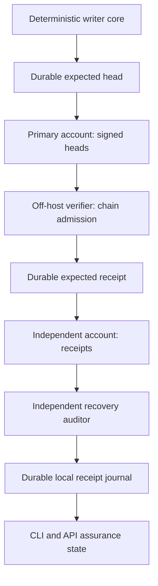
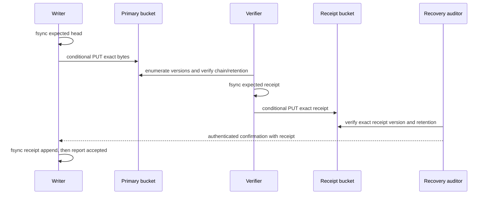
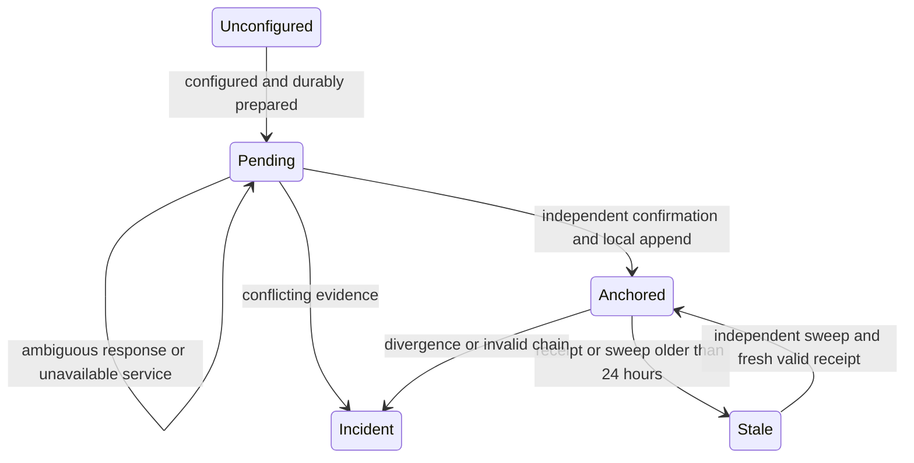

# Two-account integrity ledger - Plan

## Goal Capsule

- **Objective:** An independent auditor can detect alteration, omission, or divergence of previously accepted MootLoop integrity history after compromise of its writer host.
- **Means:** The D-09P A two-account signed-head and verifier-receipt architecture, with seven-year retention (KTD1).
- **Authority:** Damien's 2026-09-30 approval settles provider and retention. The protocol in `docs/decisions/2026-08-23-d09-remote-signed-head-sink.md` remains the governing security contract. Its request for architecture approval is historical, superseded by that answer.
- **Execution profile:** This artifact completes local planning only. Future implementation uses synthetic fixtures first. It does not assert that code, AWS accounts, independent custody, or live retention proofs exist.
- **Stop conditions:** No provisioning or spend until current pricing, budget authority, custody owners, AWS policy semantics, and account prerequisites below are verified. No real-matter use; that remains NOT YET.
- **Completion owners:** Agents can implement and verify local code; Damien supplies the separately controlled account provisioning and custody assignments. The orchestrator handles later integration and authorized publication. This plan belongs on the default branch independently of the homepage work.

---

## Product Contract

### Summary

Add a content-free integrity ledger with primary signed heads and separately retained verifier receipts.
Expose remote anchoring independently from existing local attestation validity.
Provide deterministic offline tests, policy artifacts, reconciliation, recovery, and an operator runbook before any remote rollout.

### Problem Frame

Current attestation and export seals bind local bytes but remain writable by the same host whose history they describe.
A local journal or backup cannot by itself prove that a privileged host writer has not replaced history.
A compromised host holding signing and upload credentials can still append false future entries; retained history is the protected boundary, not the truth of every future statement.
The D-09 decision packet specifies an independent admission and retention protocol; it has not yet been implemented in the inspected source.

### Key Decisions

- **D-09P A approved on 2026-09-30:** Governs R1 and R2. The choice fixes two AWS accounts and seven years; it does not approve FD6-01 off-box backups or confer real-matter authority. Approval lineage: `mootloop-2026-09-30-1309-backlog-review-2026-09-30/integrity-ledger`.

### Requirements

**Retention and custody**

- R1. Implement the complete D-09 protocol in `docs/decisions/2026-08-23-d09-remote-signed-head-sink.md`, selecting option A: two private AWS S3 general-purpose buckets with Versioning, Object Lock, and identical seven-year bucket-default Compliance retention.
- R2. Keep the writer, primary administrator, verifier/receipt custody, and recovery auditor separated as specified by D-09; the host and primary administrator cannot control the receipt account.
- R3. Retained objects survive rollback, and every security claim remains bounded by the last independently admitted receipt and its freshness.

**Privacy and proof**

- R4. Remote heads and receipts contain only the D-09 allowlisted content-free fields; never send readable matter/run identifiers, filenames, reviewer names, prompts, drafts, exports, backup data, or credential material.
- R5. Accept an anchor only after durable expected records, exact-version head admission, independently retained and audited receipt, and a durable local receipt-journal append.
- R6. Preserve D-09's exact-key retry, all-version reconciliation, sequence/prior-link admission, rotation, and recovery rules; ambiguous or conflicting evidence blocks acceptance.

**User-visible behavior**

- R7. Keep local validity and remote protection distinct across CLI and API; local success with unavailable anchoring remains `remote_anchor_pending` and cannot claim host-writer resistance.
- R8. A full two-bucket sweep runs at least every 24 hours; a newest valid receipt or sweep older than 24 hours makes current protection stale, without discarding historical proof.
- R9. Synthetic verification must cover normal acceptance, crashes, ambiguity, conflicting versions, stale proofs, rotation, privacy, and the actual separation of credentials before operational acceptance.

### Actors and acceptance examples

The attorney relies on the displayed assurance level; the deterministic MootLoop core submits heads; the off-host verifier admits the chain; the recovery auditor confirms receipts; separate account custodians provision and recover infrastructure.
Personas have no ledger credentials or authority to sign or admit history.

- AE1. Covers R5 and R7. A locally valid attestation whose upload times out remains pending; replaying its durable request cannot allocate a replacement sequence.
- AE2. Covers R5 and R6. A successful primary PUT without an independently audited retained receipt never becomes an accepted anchor.
- AE3. Covers R6. Two versions or a delete marker at the expected key cause a blocking integrity incident, even if one version has the expected bytes.
- AE4. Covers R3 and R8. A valid receipt with a 25-hour-old sweep preserves historical proof but cannot support a current host-writer-resistant claim.

### Scope Boundaries

In scope: protocol models, durable local preparation, a put-only client, independently deployed verifier/auditor logic, recovery, rotation, CLI/API status, policy artifacts, and synthetic acceptance evidence.
Outside this work: FD6-01 backup destination, encrypted backup uploads, registrar rotation, protected historical reruns, real-matter authorization, automated destruction of retained objects, and any production execution in this lane.
Do not build automatic fork repair: D-09 requires an incident rather than last-write-wins recovery.
A general-purpose event bus or persona-facing ledger tool is unnecessary because the deterministic core owns this operation; revisit only if a distinct approved caller requires it.

---

## Planning Contract

### Existing integration evidence

`src/mootloop/attest.py` writes append-only attestations and export seals, computes commitment digests, and exposes `review_integrity_status`.
`src/mootloop/models/attestations.py` holds `Attestation`, `ExportSeal`, and `ReviewIntegrityStatus`; these are local integrity contracts, not signed remote heads.
Never upload their complete serialization: attestations contain reviewer/run identity and export seals include artifact paths.

`src/mootloop/persistence.py` supplies fsynced JSONL append and complete-line recovery.
Its append lock covers a single append, so it does not serialize a read/allocate/append transaction by itself.
`src/mootloop/vault.py` supplies containment, write-once durability, and run locks.
`src/mootloop/cli/__init__.py` owns the `attest`, `export_build`, and `attest_status` commands.
`src/mootloop/cli/review.py` is a separate review-command module; the current attestation commands do not live there.
`src/mootloop/web/api/routes.py` exposes `get_run_integrity` and `attest_run`, and `src/mootloop/web/api/models.py` holds the API attestation envelope.
The integrity GET returns `ReviewIntegrityStatus` from the domain model directly.
Existing patterns and regression tests include `tests/unit/test_attest.py`, `tests/unit/test_cli_phase5.py`, and `tests/unit/test_api_endpoints.py`.

### Key Technical Decisions

- KTD1. **Adopt D-09 without replacing its protocol.** R1 fixes both buckets and retention. The packet rejected R2 because its removable lock rules and broader credential model require another architecture. A single bucket or shared administrator fails R2. This plan adds integration and verification detail; it does not reopen those alternatives.
- KTD2. **Create a separate content-free projection.** Under R4, new versioned ledger models enforce separate D-09 allowlists for heads, receipts, and rotation records. These include opaque scope, sequence, digests, key identifiers, signatures, protocol versions, UTC times, and the record-specific metadata D-09 requires: receipts bind primary object key, S3 version ID and retention mode/date; rotation records carry record type and a content-free reason code. No free-text reason may carry protected matter information. Derive stable scope using a dedicated HMAC key, backed up separately from signing rotation. Existing commitment digests bind local records without transmitting those records.
- KTD3. **Serialize the entire allocator transaction.** Under R5/R6, a dedicated per-scope append lock encloses load, next-sequence selection, and durable expected-record creation. Before network I/O, fsync exact canonical bytes, signature, digest/checksum, fixed key, scope, sequence, prior head, minimum retain-until, and pending state, including parent-directory durability. Resume reads those bytes, never reserializes or resigns an ambiguous attempt. Local state stores stay behind `safe_vault_path`.
- KTD4. **Use exact keys and version-aware verification.** Under R6, keys are `signed-heads/<opaque-scope>/<20-digit-zero-padded-sequence>.json` and `verifier-receipts/<opaque-scope>/<20-digit-zero-padded-sequence>.json`. Both PUTs require `If-None-Match: *`, checksum, TLS, and encryption. Do not infer acceptance from HTTP success, ETag, or the current object alone. The reader enumerates all versions and delete markers for the exact key, including every pagination page.
- KTD5. **Treat reconciliation as admission.** Under R5/R6, accept exactly one non-delete version with exact expected canonical bytes, signature, checksum, scope, sequence, prior link, and version-specific Compliance retention through the expected date. Zero or multiple matches, any conflicting version, any delete marker, or retention mismatch is an integrity incident. Timeout, 409, and 412 are ambiguous and stay pending until this rule is satisfied. The same rule applies independently to receipts.
- KTD6. **Checkpoint receipt durability synchronously.** Under R5, the off-host verifier first durably records the canonical expected receipt and its minimum retention date. Its receipt binds primary key/version, head digest/key identifier, observed retention, scope/sequence, observation time, and previous receipt digest. The recovery auditor independently confirms the retained receipt version before local acceptance. An off-host authenticated delivery path carries the receipt and auditor confirmation; trust comes from pinned signatures and independent observation, not a success flag supplied by the writer.
- KTD7. **Authenticate chain and key state.** Under R6, bootstrap pins genesis scope and public keys through independently controlled records. Admit only the next sequence, prior admitted head, and active key. Rotation uses the D-09 dual-signed transition record and external checkpoint before the new key can sign the following head. Preserve authenticated retired public keys throughout retention. Emergency rotation requires an approved out-of-band recovery record; a compromised old key cannot authorize recovery alone.
- KTD8. **Preserve separate assurance states.** Under R7/R8, add remote state rather than changing what local `valid` means. Missing configuration is explicitly unconfigured, prepared work is pending, confirmed proof is anchored, stale evidence is stale, and contradictions are incidents. Only a current independently confirmed chain supports the stronger claim. Existing legacy records remain readable and are not silently promoted into remote protection. Genesis is a newly witnessed baseline; anchoring an old digest now never proves that the old history was authentic before that observation.

### High-Level Technical Design

A full sweep alone does not refresh an old receipt into a new receipt.
The transition from stale to anchored requires both freshness conditions in R8.

### Assumptions and implementation prerequisites

- The first local implementation may use fixture transports and fake signing/key providers; no account credentials are required for those units.
- Per-matter scope is the proposed allocation boundary, with all runs in that scope serialized. Confirm compatibility with existing run locks before implementing allocation; the proposed lock must never reuse the same descriptor recursively or invert lock order.
- Seven years means the bucket's calendar-year default, with minimum expected dates computed conservatively from an aware UTC preparation time. Validate leap-day behavior, server timing, and retention APIs against current official AWS documentation before the S3 adapter is finalized.
- Use a maintained AWS SDK for request signing and transport rather than handwritten SigV4. The current `pyproject.toml` has no AWS SDK. Select and pin SDK/type-support versions after official documentation review; keep them isolated behind typed transport interfaces.
- The exact off-host deployment target, authenticated receipt-delivery transport, and independent admin/recovery custody require an operator inventory. They are operational prerequisites, not permission to co-locate verifier secrets on the MootLoop host.
- No AWS documentation or pricing was fetched in this network-free planning lane. Provider-specific policy condition keys, conditional-write behavior, SDK checksum behavior, retention semantics, and IAM minimum permissions require fresh official verification before production policy/adapters are considered ready.

### Cost estimate and pre-spend gate

This is a sizing illustration using hypothetical unit prices, **not current AWS pricing or spend authority**.
Assume 1,000 anchors/day, one 2 KiB head and one 2 KiB receipt per anchor, no duplicate versions, and seven years of accumulation.
The end-of-year-seven payload is about 10.47 GB across both buckets; monthly writes are about 60,000.

| Component | Hypothetical rate or allowance | Illustrative monthly cost |
|---|---|---|
| S3 stored payload at year seven | $0.023/GB-month | $0.24 |
| Both conditional PUT streams | $0.005/1,000 requests | $0.30 |
| Daily full sweep: 5.11 million objects, GET plus retention query per object | $0.0004/1,000 requests; 306.6 million requests/month | $122.64 |
| Full-sweep version listing | $0.005/1,000 requests; approximately 153,300 pages/month | $0.77 |
| Verifier compute, separate audit compute, monitoring, transfer, extra cryptographic services | Unquoted allowances; architecture/region dependent | Additional, must be priced |

At these assumptions, year-seven storage and request costs alone are roughly **$124/month**, before compute, transfer, taxes, monitoring, retries, version overhead, or currency changes.
If heads and receipts are fetched daily, the same example reads about 314 GB/month of payload; any chargeable transfer route materially changes cost.
The full-chain sweep dominates at scale; do not quietly replace it with sampling or a freshness-only check to meet a budget.
At 100 anchors/day, these variable amounts are roughly one tenth, while fixed service costs remain.

Before any spend, the operator records region, expected daily anchor volume, actual serialized sizes, intended cross-account/region traffic, compute placement, encryption choice, request classifications, and a current AWS pricing-calculator quote.
Obtain approval for a concrete monthly cap and alert thresholds, including growth to seven years.
No numeric cap is approved by this plan.

### Operational prerequisites and rollback

Damien's remaining part is to provision or designate the two accounts, identify separate primary and receipt custodians, select the region, approve the current cost ceiling, and arrange scoped credentials through approved secret custody.
Then operators can apply reviewed policies with non-secret account/bucket identifiers.

Before credentials are issued, each custodian verifies its bucket's Versioning, Object Lock, public-access block, TLS, encryption, seven-year Compliance default, and lifecycle posture.
The writer gets only primary-prefix PUT; the verifier gets the D-09 primary-reader role and a separate receipt-prefix PUT role; the recovery auditor gets only receipt-version read/list/retention access.
No persona, writer host, or primary administrator receives receipt-account administration or recovery keys.
Receipt signing keys, AWS recovery credentials, active head-signing keys, and scope-HMAC backup each retain the separate custody D-09 requires.

Rollout begins with content-free synthetic scopes in the approved accounts and records exact immutable version IDs plus retention proofs.
These test objects also carry seven-year retention and cost; never assume a temporary test bucket can be cleaned up afterward.
A credential-compromise exercise uses policy evaluation and denied operations against synthetic data; it does not attempt destructive changes to retained production objects.

Rollback disables new submissions and restores the prior application release while preserving expected-record queues, receipt journals, authenticated key state, and every retained object version.
Pending work remains pending and must be reconciled before resubmission.
Do not delete retained versions, shorten retention, destroy scope identity, or revoke auditor access needed to validate history as a rollback shortcut.
Destroy retired private keys only after the approved overlap and externally checkpointed rotation; private-key escrow needs separate explicit approval.

---

## Implementation Units

### U1. Content-free signed protocol and durable allocator

- **Goal:** Establish the locally testable wire format and crash-safe expected-object store.
- **Requirements:** R4-R6; KTD2-KTD4 and KTD7.
- **Dependencies:** None for local fixtures; confirm the scope/lock assumption before allocator implementation.
- **Files:** New `src/mootloop/models/integrity.py`, `src/mootloop/integrity.py`, `tests/unit/test_integrity_protocol.py`, and `tests/unit/test_integrity_outbox.py`; existing `src/mootloop/models/common.py`, `src/mootloop/persistence.py`, and `src/mootloop/vault.py` as pattern references.
- **Approach:** Keep canonical signing models separate from local expected-record metadata. Use dependency-injected signing and scope-key providers. Define domain-separated canonical bytes and explicit schema/algorithm versions. Implement the allocation transaction from KTD3 using an independently ordered scope lock.
- **Test scenarios:**
  - Identical allowed fields produce identical canonical bytes and verified signatures; unknown fields and unsupported versions fail closed.
  - Synthetic readable identifiers, filenames, and reviewer names never reach wire bytes, keys, logs, or error payloads.
  - Two concurrent preparations cannot allocate the same next sequence successfully.
  - Crashes before/after fsync, directory creation, and append preserve either no prepared request or the exact replayable request.
  - Missing signing/HMAC providers fail before network work; signing rotation does not change scope identity.
- **Verification:** Protocol vectors and filesystem crash/concurrency fixtures establish deterministic bytes and durable allocation without external services.

### U2. Put-only S3 transport and policy contracts

- **Goal:** Make upload behavior enforceable without giving the writer read or administrative permissions.
- **Requirements:** R1, R2, R4-R6; KTD4/KTD5.
- **Dependencies:** U1; current official AWS/SDK verification before final provider integration.
- **Files:** New `src/mootloop/integrity_s3.py`, `tests/unit/test_integrity_s3.py`, `docs/operations/integrity-ledger-policies.md`; update `pyproject.toml` and `uv.lock` only when dependencies are selected.
- **Approach:** Isolate AWS SDK calls behind typed interfaces. Policy documentation enumerates the four D-09 roles and explicit prohibited actions, without account identifiers or secrets embedded in source. Map ambiguous responses into persistent pending state.
- **Test scenarios:**
  - Capture a synthetic PUT and assert exact key, original bytes, conditional-write header, checksum, encryption, and no read/list calls.
  - Timeouts, 409/412, authentication failure, missing version ID, and checksum mismatch cannot produce acceptance.
  - Retry after restart sends the same bytes/signature/key and does not allocate a new sequence.
  - Policy fixtures reject a broad wildcard grant, missing required write conditions, and cross-account administrative overlap.
- **Verification:** Stubbed SDK transport tests pass; an external acceptance gate later proves the actual deployed role permissions rather than treating policy text as enforcement.

### U3. Off-host admission, receipt persistence, and independent audit

- **Goal:** Complete one independently witnessed anchor across both buckets.
- **Requirements:** R2, R5, R6; AE1-AE3; KTD5-KTD7.
- **Dependencies:** U1 and U2.
- **Files:** New `src/mootloop/integrity_verifier.py`, `src/mootloop/integrity_auditor.py`, `tests/unit/test_integrity_verifier.py`, and `tests/unit/test_integrity_auditor.py`.
- **Approach:** Reuse pure protocol validation while giving each service only its designated credential interface. Maintain durable off-host expected receipts and admitted scope state. Recover actual version IDs only through exact reconciliation. Select the authenticated delivery mechanism after operator inventory; fail closed until it is available.
- **Test scenarios:**
  - Covers AE2. A primary upload is admitted only after the auditor proves the exact retained receipt version.
  - Covers AE3. Zero matches, duplicate/conflicting versions, delete markers, or insufficient retention block both head and receipt reconciliation.
  - Pagination placing a conflict on the final page still raises an incident.
  - Receipt upload success followed by a crash resumes the original receipt and prior digest without resigning.
  - Skipped sequence, wrong prior head/receipt, stale allocator, and unadmitted key cannot enter the chain.
  - A forged writer acknowledgment cannot substitute for the auditor confirmation; a replayed old confirmation cannot admit a newer head.
- **Verification:** A two-bucket fixture with independent identities proves exact one-to-one admission and recovery at each crash boundary.

### U4. Recovery, rotation, and freshness

- **Goal:** Reconstruct trusted history independently of the writer's local state.
- **Requirements:** R3, R6, R8, R9; AE4; KTD5-KTD8.
- **Dependencies:** U3.
- **Files:** New `src/mootloop/integrity_recovery.py`, `tests/unit/test_integrity_recovery.py`, and `tests/unit/test_integrity_rotation.py`; extend the U3 modules for full-sweep results.
- **Approach:** Fold all versions from both prefixes by scope and sequence, compare admitted history to the local journal and backup inventory, and emit content-free incidents. Persist authenticated sweep results outside writer control. Implement ordinary dual-signature rotation and explicit externally authorized emergency recovery records.
- **Test scenarios:**
  - A tampered local journal/backup cannot override the last valid retained receipt.
  - A missing receipt, fork, gap, unexpected key, retention downgrade, or local/remote divergence blocks current assurance.
  - Covers AE4. At the 24-hour boundary and after it, independent receipt and sweep freshness are evaluated separately; rollback of the local clock cannot refresh remote evidence.
  - The old key signs through rotation sequence, the new key is rejected before the checkpoint, and only the new key signs the next head.
  - An old-key-only emergency record is rejected; missing authenticated retired public-key state prevents recovery acceptance.
- **Verification:** Recovery succeeds from retained synthetic objects with an empty local cache and fails closed on each mutated chain fixture.

### U5. Attestation and export assurance integration

- **Goal:** Present truthful remote status wherever local review integrity is exposed.
- **Requirements:** R4, R5, R7, R8; AE1/AE2/AE4; KTD2/KTD8.
- **Dependencies:** U1-U4.
- **Files:** Update `src/mootloop/attest.py`, `src/mootloop/models/attestations.py`, `src/mootloop/cli/__init__.py`, `src/mootloop/web/api/routes.py`, `src/mootloop/web/api/models.py`, `tests/unit/test_attest.py`, `tests/unit/test_cli_phase5.py`, and `tests/unit/test_api_endpoints.py`; new `tests/unit/test_integrity_integration.py`.
- **Approach:** Enqueue only digest projections after local attestation/export commitment creation. Keep synchronous local core behavior and boundary-owned network calls. Add versioned assurance fields and an explicit reconciliation/status path shared by CLI/API, with no persona execution authority. Preserve legacy reads and local validity during remote outages.
- **Test scenarios:**
  - Locally valid attestation plus failed upload returns valid local state and pending remote state in both CLI JSON and API.
  - A retained receipt whose local append fails is not reported as locally accepted; restart reconciles it without a second head.
  - An export mutation invalidates local seal state regardless of a historical anchor.
  - Missing configuration and legacy records cannot appear remotely protected.
  - CLI/API expose identical anchored, pending, stale, and incident semantics without leaking protected identifiers into remote payloads.
- **Verification:** Existing attestation/export tests remain green and end-to-end synthetic fixtures prove the full projection-to-receipt-to-status path.

### U6. Operator acceptance and recovery runbook

- **Goal:** Make operator provisioning bounded and provide evidence required for an operational claim.
- **Requirements:** R1-R3 and R9.
- **Dependencies:** U2-U5 for final acceptance; runbook drafting can precede account provisioning.
- **Files:** New `docs/operations/integrity-ledger.md`, `tests/invariants/test_integrity_boundaries.py`; update `docs/operations/integrity-ledger-policies.md` and link the decision packet without rewriting its historical approval request as current fact.
- **Approach:** Document role ownership, pricing gate, immutable synthetic rollout, independent schedules, incident escalation, key rotation, restore verification, and rollback. Add opt-in integration acceptance instructions kept out of ordinary tests; execution needs provisioned accounts and spend authority.
- **Test scenarios:**
  - Structural tests ensure persona launch configuration cannot receive ledger credential providers.
  - A synthetic acceptance drill proves actual role denials, exact version retention, separate receipt custody, and recovery after local-state loss.
  - Disabling new submissions preserves existing receipts, pending records, and auditor verification.
- **Verification:** Operators can follow the runbook with non-secret identifiers; retained signed evidence documents each remote acceptance gate. Local tests alone do not satisfy this unit's operational acceptance.

---

## Verification Contract

The repository gate is `make check`: ruff, strict mypy, and pytest excluding paid-oracle tests.
Run it before each implementation commit; use an offline dependency cache when network is forbidden.
No live AWS, provider, or protected-matter calls belong in this gate.

| Proof | Applicable units | Required result |
|---|---|---|
| Canonical protocol and privacy fixtures | U1/U5 | Exact reproducible bytes; forbidden fields absent |
| Crash, lock, and restart fixtures | U1/U3/U5 | No allocation reuse or fabricated acceptance |
| Stubbed SDK and exhaustive version fixtures | U2/U3 | Both buckets reject ambiguous/conflicting evidence |
| Recovery and rotation fixtures | U4 | Independent history governs; key transitions and freshness fail closed |
| CLI/API regression suite | U5 | Local validity and remote assurance remain separate |
| Actual AWS role/retention acceptance | U6, separately authorized | Provider enforcement and independent custody evidenced |

No tests were executed by this planning artifact's author; implementation results must be recorded by the executing lane.

---

## Definition of Done

**Confidence and review note:** A noninteractive author self-review checked D-09 fidelity, source-path/function locations, privacy, durable ordering, ambiguity, freshness, and rotation.
Noninteractive `ce-doc-review` completed five independent local persona passes: coherence, feasibility, scope guardian, security, and adversarial. One coherence correction made the KTD2 allowlists record-specific; it was applied and independently verified. No material findings remain. Cross-model review was skipped under the network-free constraint.
Confidence is strong for repository integration and the inherited protocol, while current AWS semantics, pricing, and operator custody remain unverified prerequisites.

**Local plan delivery:** this document preserves D-09P A, identifies source integration points, proposes concrete test files/scenarios, estimates cost with assumptions, and names the operational prerequisites.
This is not ledger completion.

**Local implementation:** U1-U5 and U6's local artifacts satisfy their synthetic scenarios and `make check`; no abandoned experiment code, credentials, matter data, or live infrastructure identifiers remain in the diff.
Independent review covers durable ordering, exact reconciliation, privacy projection, role separation, and rotation.

**Operational completion:** U6's separately authorized acceptance proves both configured accounts, current pricing/budget authority, separate custody, actual role denials, seven-year retention, synchronous receipt confirmation, full-chain sweep scheduling, and recovery.
Until then, D-09 remains operationally incomplete and real-matter use remains NOT YET.
